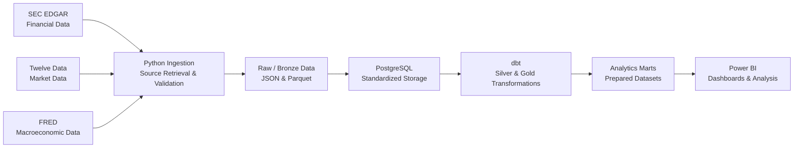

# FinStream

FinStream is an end-to-end Data Engineering project that combines corporate financial, market, and macroeconomic data into analytics-ready datasets. It emphasizes reliable ingestion, source-data preservation, standardized modeling, data quality, incremental processing, and reproducible workflows. It is not a stock-prediction or trading project.

## Data Domains

| Domain | Source | Initial use |
| --- | --- | --- |
| Corporate financial data | SEC EDGAR | Filings and structured XBRL financial facts |
| Market data | Twelve Data | Daily OHLCV market data |
| Macroeconomic data | FRED | Economic indicators with mixed frequencies |

Initial companies:

```text
AAPL
MSFT
NVDA
AMZN
XOM
WMT
```

Initial FRED series:

```text
DFF
CPIAUCSL
UNRATE
GDPC1
DGS10
```

## Data Flow



Apache Airflow has an optional development/runtime foundation, Airflow-independent source, dbt, and quality-monitoring runtime adapters, and a manually triggered V1 pipeline DAG. The DAG coordinates configured Market, SEC, and FRED source tasks, then `dbt seed`, `dbt run`, and independent `dbt test` and read-only monitoring tasks. This V1 DAG has been locally end-to-end validated with Airflow 3.3.2; no production deployment or automatic schedule is claimed. Docker Compose provides PostgreSQL local infrastructure and a custom Airflow/FinStream image with local API, scheduler, and DAG-processor services; provider/runtime configuration and complete containerized pipeline execution remain unavailable. GitHub Actions remains a separate planned V1 concern. Automated testing is introduced incrementally alongside implemented components.

## Modeling Approach

- **Bronze:** source-preserving data with minimal interpretation.
- **Silver:** cleaned, typed, standardized, deduplicated, source-aligned data.
- **Gold:** analytics-ready dimensions, facts, and marts.

Source identifiers remain available for traceability, model grains are explicitly documented, and financial, market, and macroeconomic data are not combined without defined temporal-alignment rules.

## V1 Technology Direction

The agreed V1 technology direction is Python; JSON and Parquet; PostgreSQL; dbt; Apache Airflow; Docker Compose; pytest and dbt tests; GitHub Actions; and Power BI. This direction describes planned V1 components, not a claim that every technology is already implemented.

Kafka, Apache Spark, real-time trading infrastructure, and mandatory cloud infrastructure are outside V1.

## Engineering Goals

- Incremental source ingestion where appropriate.
- Idempotent processing and duplicate prevention.
- Source-data traceability and data-quality validation.
- Clear separation between ingestion, transformation, orchestration, and BI.
- Reproducible local development and replaceable external-provider integrations.

## Documentation

- [Project Requirements](docs/PROJECT_REQUIREMENTS.md) — scope, goals, requirements, and non-goals.
- [Architecture](docs/ARCHITECTURE.md) — system architecture, data flow, and component responsibilities.
- [Data Sources](docs/DATA_SOURCES.md) — provider behavior and source constraints.
- [Data Model](docs/DATA_MODEL.md) — logical models, grains, identities, and relationships.
- [Roadmap](docs/ROADMAP.md) — implementation sequence and exit criteria.
- [Airflow Orchestration Contract](docs/AIRFLOW_ORCHESTRATION.md) — orchestration ownership, runtime/task boundaries, XCom, retry/idempotency, and local-runtime contracts.
- [Docker Local Environment Contract](docs/DOCKER_LOCAL_ENVIRONMENT.md) — Docker Compose local-runtime boundaries and reproducibility requirements.

## Implementation

FinStream is being implemented incrementally according to the roadmap. Documentation may describe agreed V1 components before implementation is complete; planned functionality is not currently available.

Setup instructions, runnable examples, screenshots, and descriptions of implemented capabilities will be added as their corresponding implementation stages are completed.
