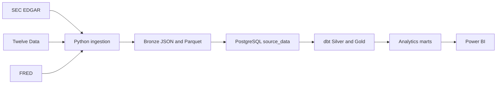
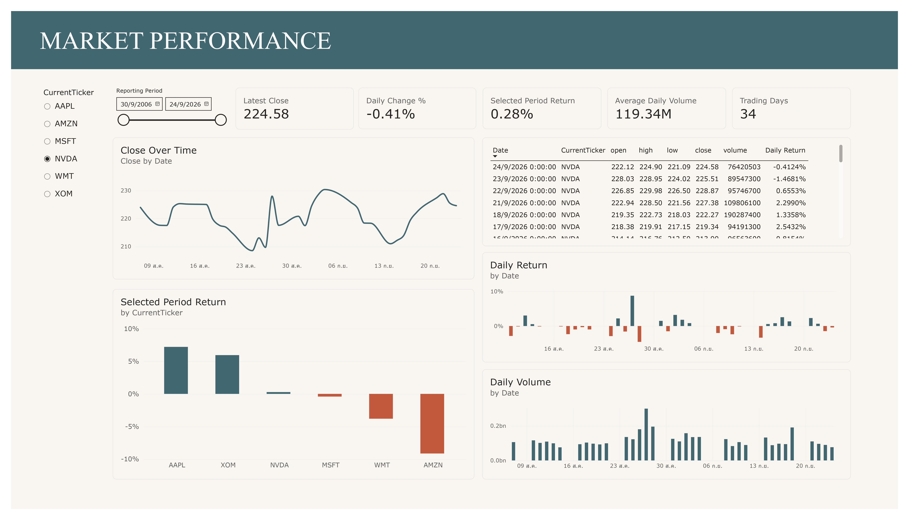
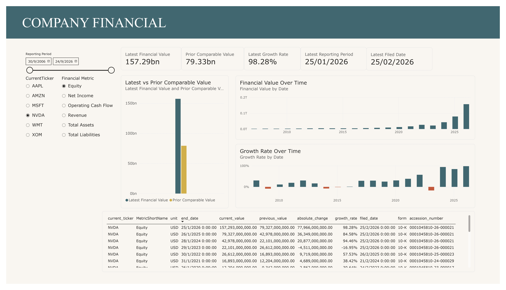
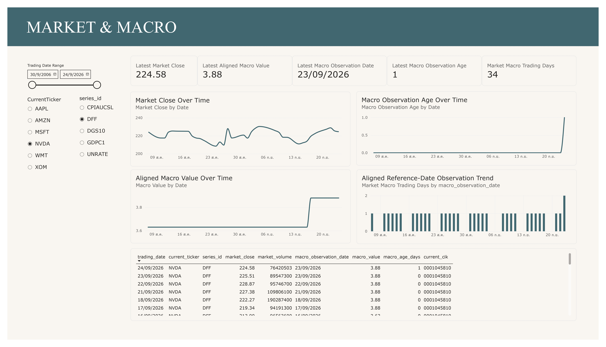

# FinStream

  
  &nbsp;&nbsp;&nbsp;
  
  &nbsp;&nbsp;&nbsp;
  
  &nbsp;&nbsp;&nbsp;
  
  &nbsp;&nbsp;&nbsp;
  
  &nbsp;&nbsp;&nbsp;
  

FinStream is a batch data platform for SEC EDGAR filings, Twelve Data daily
prices, and FRED macroeconomic series. It preserves source data, builds
PostgreSQL analytics marts with dbt, orchestrates manual runs with Airflow, and
exposes the marts through Power BI.

**Coverage:** AAPL, MSFT, NVDA, AMZN, XOM, WMT | FRED: DFF, CPIAUCSL, UNRATE,
GDPC1, DGS10

## Architecture

## Highlights

- Immutable Bronze artifacts with source, dataset, run, and row provenance.
- PostgreSQL constraints and replay checks preserve valid source revisions.
- dbt models and tests produce documented Silver, Gold, and mart relations.
- Docker Compose runs PostgreSQL and Airflow locally; `finstream_v1_pipeline`
  is manually triggered.
- GitHub Actions validates Python tests, PostgreSQL integration, and dbt checks
  on pushes to main and pull requests.
- Read-only operational status reports database, provenance, Bronze, analytics,
  and informational recency state.

## Quick Start

Use the repository virtual environment and follow the concise operational
commands in the [Runbook](docs/RUNBOOK.md). The dependency source of truth is
`pyproject.toml`; no `requirements.txt` is used.

## Dashboard Preview

These Power BI pages present the approved marts; see the [Power BI guide](docs/POWER_BI.md) for their data contract and refresh guidance.

  
  
  

## Documentation

- [Architecture](docs/ARCHITECTURE.md)
- [Data Sources](docs/DATA_SOURCES.md)
- [Data Model](docs/DATA_MODEL.md)
- [Data Quality](docs/DATA_QUALITY.md)
- [Power BI](docs/POWER_BI.md)
- [Runbook](docs/RUNBOOK.md)
