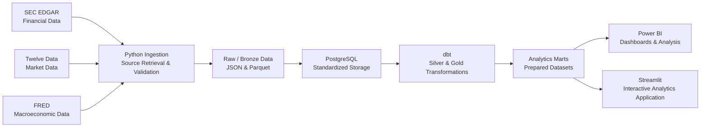

# Architecture

## Architecture Overview

FinStream V1 is a scheduled batch data platform that combines corporate financial data from SEC EDGAR, daily market data from Twelve Data, and macroeconomic data from FRED. It favors simple, replaceable components and avoids infrastructure that is not justified by the initial workload.

## Data Flow

Apache Airflow provides the workflow orchestration layer for the batch pipeline.
It is optional to the core FinStream package and supports a WSL2-based
non-containerized local runtime as well as Docker Compose on Windows hosts.
Docker Compose provides the local PostgreSQL and Airflow runtime foundation.
The remaining containerized runtime boundaries are defined in the [Docker Local
Environment Contract](DOCKER_LOCAL_ENVIRONMENT.md). GitHub Actions provides
continuous integration when configured.

## Component Responsibilities

### Python Ingestion

Python communicates with external providers, manages configuration, retrieves source data, performs ingestion-level validation, supports incremental retrieval where applicable, and persists source data. Provider-specific logic is isolated so a provider can be replaced without rewriting unrelated pipeline components.

### Raw / Bronze Storage

Bronze storage preserves source data before business transformation. It may retain raw JSON where original API responses are useful and Parquet for structured raw datasets used downstream. Its immutable run identity preserves the normalized ingestion timestamp while distinguishing the normalized source entity, so concurrent batch entities do not share artifacts.

### PostgreSQL

PostgreSQL is FinStream V1's main analytical database. It holds standardized source data and transformed analytical datasets; database constraints may contribute to duplicate prevention and idempotency.

### dbt

dbt owns SQL-based transformations in PostgreSQL, including warehouse-facing standardization, intermediate transformations, Silver and Gold models, dependency management, model tests, documentation, and lineage.

### Silver Layer

Silver data is cleaned, typed, standardized, and deduplicated, with consistent internal semantics.

### Gold Layer

Gold data contains analytics-ready facts, dimensions, and marts for analytics and BI consumption.

### Apache Airflow

Airflow is the workflow orchestration layer. It coordinates source
ingestion/loading, dbt transformation, and data-quality execution without
owning ingestion business rules, incremental logic, Bronze semantics, PostgreSQL
loading rules, transformation logic, or data-quality policy.

Market, SEC, and FRED source runtime adapters remain independent of Airflow and
compose the existing application services with their PostgreSQL loaders. DAG
definitions are thin orchestration and wiring code that calls those adapters;
source components remain independently callable and testable without Airflow.
Before source fan-out, one schema-readiness runtime call delegates to the
existing PostgreSQL source-schema boundary; source adapters do not run schema
DDL independently.
DAG authors use Airflow 3's public `airflow.sdk` API. See [the Airflow
orchestration contract](AIRFLOW_ORCHESTRATION.md).

### Docker Compose

Docker Compose provides PostgreSQL local service infrastructure and a custom
FinStream Airflow runtime image without owning FinStream business logic or
changing component boundaries. Its local runtime includes one-shot metadata
initialization, an API server, scheduler, and DAG processor using
`LocalExecutor`; scheduler task-runtime configuration is available, but provider
calls and complete pipeline execution do not occur merely by starting the
runtime. Its persistence, networking, and configuration contract is defined in
the [Docker Local Environment Contract](DOCKER_LOCAL_ENVIRONMENT.md).

For local Docker execution, external APIs flow through the Airflow task runtime
to Bronze storage, PostgreSQL source data, dbt transformations, and quality
monitoring with analytical outputs. This preserves the existing application
boundaries while making the manually triggered V1 pipeline reproducible locally.

### Power BI

Power BI consumes prepared Gold-layer datasets. Shared business logic should be prepared upstream when appropriate rather than duplicated across dashboards.

### Streamlit

Streamlit provides an interactive analytical application over prepared Gold and mart outputs. It owns presentation, filtering, drill-down, and read-only exploration. It does not own shared business transformations or metric definitions, and it does not control Airflow or mutate pipeline data.

## Processing Model

FinStream V1 uses scheduled batch processing. Since source publication frequencies differ, the platform does not assume every source has new data on every run. It supports detecting new or revised records, incremental processing where appropriate, safe reruns, and duplicate prevention without defining exact schedules.

## Separation of Responsibilities

| Component | Primary responsibility |
| --- | --- |
| Python | External-source ingestion and ingestion-level processing |
| Raw / Bronze Storage | Preserve source data |
| PostgreSQL | Store standardized and analytical datasets |
| dbt | SQL transformations and analytical model construction |
| Airflow | Workflow orchestration |
| Docker Compose | PostgreSQL local infrastructure and Airflow Compose runtime |
| Power BI | Consume prepared analytical datasets |
| Streamlit | Interactive analytical application and exploration over prepared datasets |

These boundaries keep components independently understandable, testable, and replaceable.

## V1 Technology Decisions

The agreed V1 technologies are Python, JSON, Parquet, PostgreSQL, dbt, Apache Airflow, Docker Compose, pytest, dbt tests, GitHub Actions, and Power BI. Kafka, Apache Spark, and mandatory cloud infrastructure are intentionally outside V1 because the initial workloads are batch-oriented and do not justify that infrastructure.
The agreed V1 technologies are Python, JSON, Parquet, PostgreSQL, dbt, Apache Airflow, Docker Compose, pytest, dbt tests, GitHub Actions, Power BI, and Streamlit. Kafka, Apache Spark, and mandatory cloud infrastructure are intentionally outside V1 because the initial workloads are batch-oriented and do not justify that infrastructure.

## Architecture Boundaries

This document owns FinStream's system architecture, component responsibilities, data flow, and processing boundaries.

It does not own provider contracts, source characteristics, authentication, update behavior, or source limitations (`DATA_SOURCES.md`); table or model grains, relationships, facts, dimensions, or analytical structures (`DATA_MODEL.md`); implementation order or project phases (`ROADMAP.md`); or project scope, goals, requirements, system qualities, non-goals, and success criteria (`PROJECT_REQUIREMENTS.md`).
