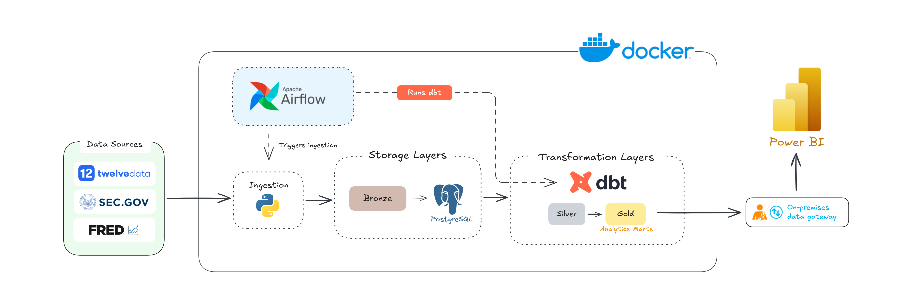

# FinStream Architecture

## Overview

FinStream is a local batch data platform for Twelve Data market prices, SEC
EDGAR filings, and FRED macroeconomic series. Python validates and captures
source data, PostgreSQL preserves source rows and provenance, dbt builds tested
analytical layers, Airflow orchestrates workflows, and Power BI presents the
approved marts.

Docker contains the local processing runtime. Provider APIs, the Standard
On-premises Data Gateway, and Power BI remain outside that boundary.

## Architecture Diagram

Solid arrows show data flow. Dashed arrows show Airflow control: Airflow
triggers ingestion and dbt, but is not itself a data layer.

## Data Flow & Layers

The lineage is external sources -> Python ingestion -> Bronze -> PostgreSQL
source tables -> dbt Silver -> dbt Gold -> Power BI. dbt materializes and tests
both the Silver and Gold transformations.

### Bronze

Bronze stores immutable source-aligned JSON and typed Parquet for each
ingestion run. The artifacts support reproducibility, recovery, replay, and
traceability; Bronze is not an analytical layer.

### PostgreSQL Source Layer

The `source_data` schema stores validated source rows and ingestion provenance.
The full `(source, dataset, run_id)` identity, ingestion timestamp, and source
row number preserve exact-run traceability and replay verification. PostgreSQL
also hosts dbt outputs, but PostgreSQL itself is not Silver.

### Silver

Silver is the logical dbt staging and standardization layer. Typed staging
models normalize source representations, apply mappings, and establish tested
keys, relationships, and grains. This terminology does not imply a physical
PostgreSQL schema named `silver`.

### Gold

Gold contains business-ready dimensions, facts, and the marts consumed by
Power BI:

| Mart | Purpose |
| --- | --- |
| `analytics.mart_company_daily_performance` | Daily company market performance. |
| `analytics.mart_company_financial_growth` | Reported financial values and comparable-period growth. |
| `analytics.mart_market_macro` | Market observations aligned with macro reference dates. |

## Orchestration & Incremental Processing

Airflow orchestrates source-schema setup, ingestion, dbt transformations and
tests, and quality monitoring.

| DAG | Behavior |
| --- | --- |
| `finstream_v1_pipeline` | Manually triggered full Market, SEC, and FRED workflow, including dbt seed/run/test and quality monitoring. |
| `finstream_market_daily` | Market-only pipeline at 18:30 `America/New_York`, Monday-Friday; `catchup=False` and `max_active_runs=1`. |

- **Market:** Each symbol starts from its latest stored `trading_date` minus
  three calendar days and requests through the provider's latest date. The
  overlap supports recovery and recent revisions within that overlap window;
  an explicit supported date range takes precedence.
- **FRED:** Observations start from each series' maximum stored observation date
  minus 365 days. Metadata remains a full refresh.
- **SEC:** Submissions and Company Facts use current/full retrieval.

Missed daily Airflow runs are not recreated. On the next execution, the Market
incremental window recovers missing provider observations. The daily DAG does
not fetch SEC or FRED.

## Data Quality

| Boundary | Responsibility |
| --- | --- |
| Source/Python | Provider shape, identities, types, dates, and source invariants. |
| Bronze | Immutable artifacts, deterministic counts, and recovery integrity. |
| PostgreSQL | Provenance, per-run constraints, and replay verification. |
| dbt | Analytical grains, keys, relationships, mappings, and mart contracts. |
| Monitoring | Read-only recency and run-count observations. |

Source contract violations stop ingestion and dbt test failures stop analytical
validation. Recency and run counts are informational unless evaluation fails.

## Analytics & Power BI

Power BI is FinStream's visualization layer. The PBIP project connects to
`PostgreSQL.Database("localhost:5433", "finstream")` and contains **Market
Performance**, **Company Financial**, and **Market & Macro** pages. Power BI
Service refresh uses a Standard On-premises Data Gateway and is scheduled
Tuesday-Saturday at 08:00 ICT (UTC+7), after the expected prior U.S. market
pipeline completion, with buffer.

`mart_market_macro` is current-vintage and aligned by observation/reference
date. It is not publication-time or release-time aware, ALFRED-vintage aware,
or a historical no-lookahead reconstruction. Repeated lower-frequency values
across later trading dates are reference-date alignment, not interpolation or
imputation.
