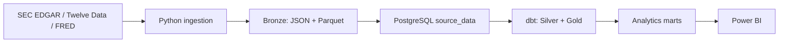

# Architecture

FinStream is a scheduled batch system. Python retrieves and validates provider
responses, Bronze preserves immutable source artifacts, PostgreSQL stores
source-aligned rows and provenance, dbt produces analytics relations, Airflow
coordinates manual and scheduled batch runs, and Power BI consumes marts.

## Components

| Component | Responsibility |
| --- | --- |
| Python | Provider access, parsing, validation, Bronze persistence, and source loading. |
| Bronze | Immutable Raw JSON and typed Parquet artifacts for an ingestion run. |
| PostgreSQL | Source rows, ingestion provenance, constraints, replay verification, and analytics relations. |
| dbt | Source declarations, transformations, tests, seeds, and mart lineage. |
| Airflow | Manual full-pipeline and scheduled Market-only batch execution of the existing runtime adapters. |
| Docker Compose | Local PostgreSQL and Airflow services. |
| Operational status | Read-only inspection of database, provenance, Bronze, analytics, and recency state. |
| Power BI | Semantic model and dashboards over approved analytics marts. |

## Runtime Boundaries

Compose runs `postgres`, `airflow-init`, `airflow-api-server`,
`airflow-scheduler`, and `airflow-dag-processor`. The DAG ID
`finstream_v1_pipeline` is the manual full-pipeline DAG. It has no schedule and
does not run merely because Compose starts; it continues to orchestrate Market,
SEC, FRED, dbt seed, dbt run, dbt test, and quality monitoring.

`finstream_market_daily` is a separate weekday Market-only DAG. It runs at
18:30 America/New_York, after the normal 16:00 US market close, with
`catchup=False` and one active run at a time. It schedules batch ingestion, not
real-time streaming: it runs source-schema preparation, configured Market
ticker ingestion, dbt run, dbt test, and quality monitoring. SEC and FRED are
not fetched, and static dbt seeds are not refreshed by this weekday DAG. The
weekday schedule does not use an exchange-holiday calendar; the established
incremental/idempotent Market behavior handles days with no new trading date.

Docker, Airflow, and PostgreSQL must be running locally when the schedule is
due. Step 16.1 does not implement Power BI automatic refresh.

The operational-status command issues PostgreSQL `SELECT` queries and local
filesystem reads only. dbt tests remain the analytical-quality gate; Airflow
logs provide task-level diagnostics. GitHub Actions is configured for automated
checks without provider credentials or Compose startup.

## Scope

FinStream is batch-oriented. It does not provide real-time ingestion, streaming,
trading, cloud deployment, external alerting, freshness SLAs, anomaly detection,
or release-aware macroeconomic vintage reconstruction.
