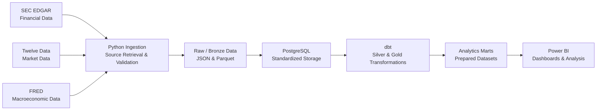

# Architecture

## Architecture Overview

FinStream V1 is a scheduled batch data platform that combines corporate financial data from SEC EDGAR, daily market data from Twelve Data, and macroeconomic data from FRED. It favors simple, replaceable components and avoids infrastructure that is not justified by the initial workload.

## Data Flow

Later in V1, Apache Airflow will orchestrate pipeline execution, Docker Compose will provide reproducible local infrastructure, and GitHub Actions will provide continuous integration. These components are planned, not yet implemented.

## Component Responsibilities

### Python Ingestion

Python communicates with external providers, manages configuration, retrieves source data, performs ingestion-level validation, supports incremental retrieval where applicable, and persists source data. Provider-specific logic is isolated so a provider can be replaced without rewriting unrelated pipeline components.

### Raw / Bronze Storage

Bronze storage preserves source data before business transformation. It may retain raw JSON where original API responses are useful and Parquet for structured raw datasets used downstream.

### PostgreSQL

PostgreSQL is FinStream V1's main analytical database. It holds standardized source data and transformed analytical datasets; database constraints may contribute to duplicate prevention and idempotency.

### dbt

dbt owns SQL-based transformations in PostgreSQL, including warehouse-facing standardization, intermediate transformations, Silver and Gold models, dependency management, model tests, documentation, and lineage.

### Silver Layer

Silver data is cleaned, typed, standardized, and deduplicated, with consistent internal semantics.

### Gold Layer

Gold data contains analytics-ready facts, dimensions, and marts for analytics and BI consumption.

### Apache Airflow

Airflow will be introduced after ingestion and transformation components are stable. It orchestrates dependencies across ingestion, loading, transformation, and data quality checks; it does not own transformation business logic.

### Power BI

Power BI consumes prepared Gold-layer datasets. Shared business logic should be prepared upstream when appropriate rather than duplicated across dashboards.

## Processing Model

FinStream V1 uses scheduled batch processing. Since source publication frequencies differ, the platform does not assume every source has new data on every run. It supports detecting new or revised records, incremental processing where appropriate, safe reruns, and duplicate prevention without defining exact schedules.

## Separation of Responsibilities

| Component | Primary responsibility |
| --- | --- |
| Python | External-source ingestion and ingestion-level processing |
| Raw / Bronze Storage | Preserve source data |
| PostgreSQL | Store standardized and analytical datasets |
| dbt | SQL transformations and analytical model construction |
| Airflow | Workflow orchestration |
| Power BI | Consume prepared analytical datasets |

These boundaries keep components independently understandable, testable, and replaceable.

## V1 Technology Decisions

The agreed V1 technologies are Python, JSON, Parquet, PostgreSQL, dbt, Apache Airflow, Docker Compose, pytest, dbt tests, GitHub Actions, and Power BI. Kafka, Apache Spark, and mandatory cloud infrastructure are intentionally outside V1 because the initial workloads are batch-oriented and do not justify that infrastructure.

## Architecture Boundaries

This document owns FinStream's system architecture, component responsibilities, data flow, and processing boundaries.

It does not own provider contracts, source characteristics, authentication, update behavior, or source limitations (`DATA_SOURCES.md`); table or model grains, relationships, facts, dimensions, or analytical structures (`DATA_MODEL.md`); implementation order or project phases (`ROADMAP.md`); or project scope, goals, requirements, system qualities, non-goals, and success criteria (`PROJECT_REQUIREMENTS.md`).
