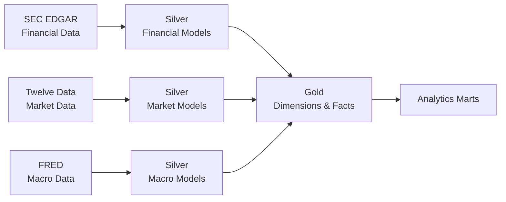

# Data Model

## Overview

FinStream separates source-preserving data from standardized and analytical models:

- **Bronze** preserves source data with minimal interpretation.
- **Silver** contains cleaned, typed, standardized, deduplicated, source-aligned models.
- **Gold** contains analytics-ready dimensions, facts, and marts.

Bronze is upstream raw storage and is not the final analytical schema.

## Data Model Flow

Bronze storage exists upstream of these models and preserves original source payloads before standardization.

## Modeling Principles

- Every fact and mart must have an explicitly documented grain.
- Stable source identifiers must remain available for traceability.
- Ticker symbols must not serve as the sole long-term company identity.
- Silver models retain source-specific metadata when needed for traceability; Gold models normalize business meaning.
- Financial, market, and macroeconomic data must not be assumed to share a frequency.
- Monthly or quarterly data must not be silently forced onto a daily grain.
- Derived metrics require documented definitions.
- Source differences must not be hidden in ways that make analytical results misleading.

## Silver Models

Silver models remain close to their source domains while applying consistent naming, types, and duplicate handling.

### `stg_market_prices`

> Grain: One row per symbol per trading date.

Typical logical fields include symbol, trading date, open, high, low, close, volume, source, and ingestion metadata.

### `stg_financial_facts`

This model represents normalized SEC XBRL fact occurrences.

> Grain: One reported financial fact occurrence from one SEC filing context.

It retains traceability information including company or CIK, taxonomy, source concept, unit, reporting period, filing form, filing date, accession information, and available fiscal metadata. Similarly named XBRL concepts from different companies are not assumed to be equivalent. Canonical mapping remains outside Silver and is applied only in Gold from a curated contract.

### `stg_macro_observations`

> Grain: One retrieved observation for a FRED series, observation date, and source real-time context.

This model retains series ID, observation date, value, available source real-time metadata, and other source metadata required for interpretation. V1 does not claim complete historical vintage coverage unless ingestion explicitly retrieves that history.

## Gold Dimensions

### `dim_company`

This dimension represents companies shared between SEC financial and market data.

> Grain: One row per company identified by SEC CIK.

Logical attributes may include CIK, current ticker, and company name. CIK is the primary stable business identity; ticker is not the sole permanent identifier because ticker symbols may change. The configured current ticker-to-CIK mapping is sufficient for V1, without a full Slowly Changing Dimension implementation.

### `dim_date`

> Grain: One row per calendar date.

This dimension provides reusable calendar attributes. Market facts occur only on trading dates, financial facts retain reporting-period semantics, and macroeconomic facts retain observation-date semantics. These dates are not interchangeable.

### `dim_macro_series`

> Grain: One row per FRED series ID.

Logical attributes may include series ID, title, frequency, units, and seasonal-adjustment metadata.

### `dim_financial_metric`

This dimension represents canonical FinStream financial metrics for cross-company analytics, conceptually including revenue, net income, assets, liabilities, cash, stockholders' equity, and earnings per share.

> Grain: One row per canonical FinStream financial metric.

The initial version-controlled mapping contract explicitly maps selected SEC taxonomy-plus-concept pairs to stable metric keys. It is intentionally curated and incomplete: unmapped SEC facts remain valid Silver data, and broader normalization remains deferred. The mapping defines semantic identity only; currency, unit, scale, and period normalization are outside its scope.

## Gold Facts

### `fact_market_daily`

> Grain: One row per source symbol per trading date.

Measures are open, high, low, close, and volume. No ticker-to-CIK crosswalk is applied; the model retains the validated Silver symbol and trading-date grain.

### `fact_financial_reported`

This fact represents mapped values reported through SEC filings.

> Grain: One mapped reported SEC financial fact occurrence from one filing context.

Only approved taxonomy-plus-concept mappings enter this fact; unmapped SEC facts remain valid Silver data. It retains source taxonomy and concept, filing identity, reporting period, fiscal context, and source units. Company fiscal periods must not be forced into calendar quarters when fiscal calendars differ.

### `fact_macro_observation`

> Grain: One current canonical value per macro series per observation date.

Silver retains available source real-time metadata. This fact selects the latest available realtime context per series and observation date, with deterministic provenance tie-breaking. If full revision or vintage analytics are later required, a dedicated vintage-aware model must be introduced rather than silently changing the meaning of `fact_macro_observation`.

## Analytics Marts

Analytics marts serve as the shared, upstream prepared analytical layer consumed by both Power BI and Streamlit. Neither downstream consumer should independently define metric calculations, company identity mappings, or cross-domain temporal alignments. All marts are designed to be consumer-independent, reproducible, and verifiable against underlying Gold models.

### Company Identity & Predecessor/Successor Registrant Strategy

Market Gold (`fact_market_daily`) retains source trading symbols (`symbol`), while SEC Financial Gold (`fact_financial_reported`, `dim_company`) operates on canonical SEC Central Index Keys (`cik`).

To bridge these domains cleanly across analytical marts, FinStream establishes `company_key` as the stable, durable analytical company identity. Ticker symbols can be reassigned, redomiciled, or vary across trading venues over time, and SEC CIKs change when corporate reorganizations occur; therefore, neither ticker nor CIK alone serves as the sole durable analytical identity across domains.

#### Company Identity Mapping Contract
The analytical company identity mapping contract conceptually contains:
- `company_key`: The stable FinStream analytical company identity (e.g. `AAPL`, `MSFT`, `NVDA`, `AMZN`, `XOM`, `WMT`).
- `current_ticker`: The active trading symbol used in market data feeds.
- `source_cik`: The SEC Central Index Key associated with regulatory filings.
- `registrant_role`: The functional corporate role of the CIK (`primary`, `successor`, or `predecessor`).
- `is_current_registrant`: Boolean flag (`TRUE` for active trading/reporting registrants, `FALSE` for legacy/predecessor entities).

**Cardinality & Provenance Rules:**
- One `company_key` may map to more than one `source_cik`.
- For V1 ordinary companies (`AAPL`, `MSFT`, `NVDA`, `AMZN`, `WMT`), each `company_key` currently maps to exactly one primary source CIK with `registrant_role = 'primary'` and `is_current_registrant = TRUE`.
- For `XOM`, the entity has a current successor CIK relationship (`0002115436`, `registrant_role = 'successor'`, `is_current_registrant = TRUE`) and a predecessor CIK relationship (`0000034088`, `registrant_role = 'predecessor'`, `is_current_registrant = FALSE`).
- `source_cik` must always remain available on mart facts for regulatory auditability and provenance.

#### Predecessor and Successor Registrant Continuity (XOM Investigation)
Profiling and SEC regulatory filings confirm that current ticker identity does not necessarily equal historical SEC registrant continuity:
- On July 1, 2026, Exxon Mobil Corporation completed a corporate reorganization/redomiciliation.
- **ExxonMobil Holdings Corporation** (CIK `0002115436`) became the new publicly traded parent and successor registrant, retaining ticker `XOM` on the NYSE without operational interruption.
- All historical annual 10-K filings prior to July 2026 belong to the predecessor registrant **Exxon Mobil Corporation** (legacy CIK `0000034088`), while subsequent filings belong to successor CIK `0002115436`.

To support corporate continuity without arbitrary Slowly Changing Dimensions (SCD):
1. **Analytical Company Identity:** Downstream analytical models associate the stable analytical company identity (`company_key`) with one or more source CIKs, classifying them by role (`successor` vs. `predecessor`).
2. **Provenance Preservation:** Source CIKs are retained on all facts to preserve reporting auditability and prevent accidental cross-company merging.
3. **Predecessor Ingestion Continuity:** Predecessor CIK `0000034088` is ingested through standard SEC source boundaries to populate multi-year financial history for XOM, linking to `company_key = 'XOM'` without fabricating synthetic financial rows.

#### V1 Conceptual Company Identity Crosswalk

| company_key | current_ticker | source_cik | registrant_role | is_current_registrant |
| --- | --- | --- | --- | --- |
| AAPL | AAPL | 0000320193 | primary | TRUE |
| MSFT | MSFT | 0000789019 | primary | TRUE |
| NVDA | NVDA | 0001045810 | primary | TRUE |
| AMZN | AMZN | 0001018724 | primary | TRUE |
| XOM | XOM | 0002115436 | successor | TRUE |
| XOM | XOM | 0000034088 | predecessor | FALSE |
| WMT | WMT | 0000104169 | primary | TRUE |

---

### `mart_company_daily_performance`

#### Purpose
Provides company-level daily market performance and trading metrics for downstream dashboards, charts, and exploration.

#### Grain
One row per analytical company (`company_key`) per market trading date (`trading_date`).

#### Source Gold Models
- `fact_market_daily`
- `dim_company` (bridged via company identity mapping)

#### Identity Keys & Attributes
- Primary Key: `company_key`, `trading_date`
- Attributes: `current_ticker`, `company_name`, `current_cik`, `trading_date`, `open`, `high`, `low`, `close`, `volume`, `previous_close`, `daily_change`, `daily_return`

#### Market Data Join Rule
Market data (`fact_market_daily`) joins only to the current ticker and current registrant mapping (`is_current_registrant = TRUE`). This ensures that predecessor CIKs (such as legacy XOM CIK `0000034088`) do not duplicate market performance rows. `current_cik` is retained on each row for regulatory provenance.

#### Temporal Semantics
- Evaluated strictly across available market trading dates.
- Gaps for weekends and official exchange holidays are naturally preserved; no synthetic weekend or holiday observations are manufactured.

#### Derived Metric Definitions
- `previous_close`: Closing price of the immediately preceding available market trading observation for the same company (`company_key`), ordered by `trading_date`. This reflects the prior trading session (e.g. Friday close for a Monday session), not calendar day.
- `daily_change`: `close - previous_close`
- `daily_return`: `(close / previous_close) - 1` (equivalent to `(close - previous_close) / previous_close`)

#### Null & Edge-Case Rules
- `previous_close`, `daily_change`, and `daily_return` are `NULL` for the first available trading date of each company.
- If `previous_close` is zero or null, `daily_return` evaluates to `NULL` to prevent division by zero.
- Valid `NULL` volume values from the source are retained without alteration.

#### Important Exclusions
- Does not contain stock price predictions, forecasts, price targets, or trade execution recommendations.
- Does not compute intraday or technical momentum indicators outside V1 requirements.

---

### `mart_company_financial_growth`

#### Purpose
Enables company-level multi-year financial performance, trend analysis, and year-over-year (YoY) growth tracking while preserving fiscal calendar boundaries and reporting provenance.

#### Grain
One row per analytical company (`company_key`) per canonical financial metric (`metric_key`) per annual reporting period (`end_date`) per unit (`unit`).

#### Source Gold Models
- `fact_financial_reported`
- `dim_company` (bridged via company identity mapping)
- `dim_financial_metric`

#### Identity Keys & Attributes
- Primary Key: `company_key`, `metric_key`, `end_date`, `unit`
- Attributes: `current_ticker`, `source_cik`, `metric_name`, `period_type`, `taxonomy`, `concept`, `fiscal_year`, `start_date`, `current_value`, `previous_end_date`, `previous_value`, `absolute_change`, `growth_rate`, `form`, `filed_date`, `accession_number`

#### Provenance & Fact Joining
Financial facts join `source_cik` to the company identity mapping to associate each fact with its `company_key`. The mart retains the `source_cik` that produced the selected representative fact to preserve audit provenance across corporate predecessor/successor events.

#### Period Selection & Deterministic Representative Fact Deduplication
The underlying `fact_financial_reported` table retains every reported fact occurrence across SEC filings, including comparative prior-period disclosures, footnote occurrences, and amended filings. To construct a deterministic annual analytical series:
1. **Annual Filing Filter:** Considers only annual SEC filing contexts (`form IN ('10-K', '10-K/A')` with `fiscal_period = 'FY'`).
2. **Duration vs. Instant Distinction:**
   - **Duration Metrics** (`contract_revenue_excluding_assessed_tax`, `net_income_attributable_to_parent`, `operating_cash_flow`): Require `start_date IS NOT NULL` with duration `(end_date - start_date)` spanning an annual interval (`350` to `380` days). Shorter-duration quarterly facts reported in 10-Ks are excluded.
   - **Instant Metrics** (`equity_attributable_to_parent`, `total_assets`, `total_liabilities`): Require `start_date IS NULL`. The point-in-time balance sheet date is represented by `end_date`.
3. **Representative Fact Selection at Analytical Grain:**
   - Selection operates at the analytical company-period grain: `(company_key, metric_key, end_date, unit)`.
   - If multiple filings report the same period (across comparative periods, amended filings, or predecessor/successor entities), the observation is ranked by:
     `filed_date DESC, accession_number DESC`
     to select the latest filed revision or amendment, while retaining the underlying `source_cik` and `accession_number` as provenance.
   - Profiling of the current local V1 warehouse confirms **zero residual ties** under this ranking (every partition has a unique `(filed_date, accession_number)` pair).
   - While `filed_date DESC, accession_number DESC` is empirically deterministic for current V1 data, future SEC expansions reporting multiple dimensional segments under a single concept in the same accession would require upstream disambiguation rather than arbitrary sorting.

#### Period Sequencing & YoY LAG Partitioning
- **Partitioning Rule:** Period sequencing and `LAG()` window calculations must partition by:
  `company_key, metric_key, unit`
  and order by `end_date ASC` (NOT partitioned by `source_cik`).
- **Registrant Continuity Across Predecessor/Successor:** Partitioning by `company_key` ensures that historical predecessor periods (legacy CIK `0000034088`) and subsequent successor periods (CIK `0002115436`) seamlessly form a single contiguous analytical series under `company_key = 'XOM'`.
- **Fiscal Calendar Preservation:** Preserves each company's native fiscal calendar (e.g. Walmart's late-January end, Apple's late-September end, Microsoft's June end) rather than forcing dates into calendar quarters.
- **Consecutive Annual Validation:** A comparison is considered a valid consecutive YoY interval only if `(end_date - previous_end_date)` is approximately one full year (`350` to `380` days). If a reporting gap indicates a missing year or non-annual span, `growth_rate` is not calculated as YoY and remains `NULL`.

#### Derived Metric Definitions
- `current_value`: Representative reported value for the fiscal year.
- `previous_value`: Representative reported value for the preceding comparable fiscal year.
- `absolute_change`: `current_value - previous_value`
- `growth_rate`: `(current_value - previous_value) / ABS(previous_value)`
  - Denominator uses `ABS(previous_value)` to maintain correct growth direction when transitioning from negative values (e.g. net losses).

#### Null & Edge-Case Rules
- `previous_value`, `absolute_change`, and `growth_rate` are `NULL` for a company's earliest available annual observation.
- `previous_value` reflects the immediately preceding representative reported value. Zero is a valid reported value; if `previous_value = 0`, `absolute_change` remains calculable (`current_value - 0`), while `growth_rate` evaluates to `NULL` to avoid division by zero.
- Non-consecutive periods (where `end_date - previous_end_date` is outside `350` to `380` days) retain `previous_end_date` and `previous_value` for auditability, but `absolute_change` and `growth_rate` evaluate to `NULL`.
- **No Row Fabrication:** Predecessor CIK `0000034088` and successor CIK `0002115436` are available under `company_key = 'XOM'` according to the identity contract. The mart uses only qualifying reported SEC annual facts actually present; no synthetic periods, interpolated values, or fabricated successor annual records are created.
- Observations with differing units are never compared; all six canonical V1 metrics operate natively in `USD`.

#### Important Exclusions
- Does not perform currency normalization, cross-currency conversions, or unit conversions.
- Does not interpolate missing annual periods or manufacture non-reported numbers.

---

### `mart_market_macro`

#### Purpose
Provides cross-domain analytical alignment combining daily market performance with mixed-frequency macroeconomic indicators for retrospective descriptive analysis, visualization, and macroeconomic regime correlation.

#### Grain
One row per analytical company (`company_key`) per market trading date (`trading_date`) per macroeconomic series (`series_id`).

#### Long-Form Design Rationale
A normalized long-form structure (`company_key + trading_date + series_id`) is selected over wide columns because it:
- Preserves discrete series identity and units without schema alteration.
- Accommodates mixed source observation frequencies (daily, monthly, quarterly).
- Enables flexible slicing, filtering, and cross-series visualization in Power BI and Streamlit.
- Remains extensible for future macroeconomic series additions.

#### Source Models
- `mart_company_daily_performance`
- `fact_macro_observation`
- `dim_macro_series`

#### Identity Keys & Attributes
- Primary Key: `company_key`, `trading_date`, `series_id`
- Attributes: `current_ticker`, `company_name`, `current_cik`, `trading_date`, `market_close`, `market_volume`, `series_id`, `macro_observation_date`, `macro_value`, `macro_age_days`

#### Market Join & Provenance Rule
The market grain and identity are inherited from `mart_company_daily_performance`, which uses only the current registrant mapping (`is_current_registrant = TRUE`) to avoid duplicate rows from predecessor CIKs. The active regulatory identifier (`current_cik`) and `current_ticker` are retained on every row for traceability and provenance.

#### Retrospective Observation-Date Alignment Contract
FinStream V1 retrieves standard FRED series observations representing current-vintage values. The temporal alignment rule:
- For each company trading date and series, selects the latest current-canonical macro observation satisfying:
  `macro_observation_date <= trading_date`
- Selection is based on observation date independently of value nullability. A latest eligible observation with a legitimate source `NULL` remains selected; the alignment does not search farther back for a non-null value.
- **Semantics of the Rule:** This rule ensures only that the macroeconomic reference period (e.g. month of August or Q1 2026) does not occur after the market trading session. It provides consistent temporal co-location of economic reference periods against market sessions.
- **Current-Vintage & Publication Limitation:** Standard FRED observation dates are economic reference dates, not publication or release dates. Because standard FRED data reflects current-vintage numbers (incorporating subsequent historical revisions) and lacks historical release timestamps, this alignment:
  - Does **NOT** establish that the value was publicly available or known to market participants on `trading_date`.
  - Does **NOT** eliminate look-ahead bias from historical revisions or release lags.
  - Is **NOT** suitable for point-in-time strategy backtesting or historical information-set simulation.
  - If true point-in-time, no-lookahead analytics are required in a future phase, they require an explicit vintage/release-aware data source (e.g. ALFRED) rather than the current standard FRED pipeline.

#### Reference-Date Age
Because monthly and quarterly indicators update less frequently than market trading days, the latest available macro observation is aligned across subsequent trading dates until the next period is observed. To maintain transparency:
- `macro_age_days = trading_date - macro_observation_date`
- `macro_age_days` defines the **reference-date age** (the elapsed calendar days between the market trading session and the beginning of the macroeconomic reference period).
- It is explicitly not defined as publication lag, release lag, or availability lag.

#### Null & Edge-Case Rules
- Legitimate source missing values (such as holiday `NULL` values in `DGS10`) are preserved without synthetic imputation.
- If no macro observation exists on or prior to a trading date for a given series, `macro_observation_date`, `macro_value`, and `macro_age_days` all evaluate to `NULL`.

#### Important Exclusions
- Does not interpolate, alter, or impute macro observations. Each trading-date row references the latest eligible source observation by reference date; repeated use of that observation across later trading dates is as-of reference-date alignment, not publication-time or value imputation.
- Does not manufacture synthetic daily records for monthly or quarterly series.
- Does not generate predictive or macroeconomic forecasts.
- Does not claim point-in-time informational availability or zero-lookahead backtest validity.

## Keys and Identity

Natural source identifiers remain available for traceability:

| Entity | Source identity |
| --- | --- |
| SEC company | CIK |
| Market observation | Ticker or symbol |
| FRED series | Series ID |
| SEC filing | Accession information |

Gold dimensions may later use surrogate keys for warehouse relationships, but they do not replace source identifiers. Exact database key types and constraints are deferred.

Bronze execution provenance is separate from these source-record identities. A
Bronze source run preserves one normalized ingestion timestamp and distinguishes
its normalized source entity so separate entities in one batch do not share one
physical run; it does not change logical Silver or Gold grains.

## Data Quality Expectations

### Market Data

- Symbol and trading date are required.
- Symbol plus trading date is unique.
- High is greater than or equal to low, open, and close.
- Low is less than or equal to open and close.
- Volume is non-negative when supplied.

### Financial Data

- Company identity, reporting-period context, and filing identity are required.
- A source concept or mapped metric is required.
- Units are required where applicable.
- Not every financial metric is expected to exist for every company.

### Macroeconomic Data

- Series identity and observation date are required.
- Valid source missing-value markers must be handled correctly.
- A legitimate no-new-data result must not automatically be treated as pipeline failure.
- Revision metadata must not be discarded when intentionally retrieved.

These are logical expectations, not implemented dbt tests.

## Data Model Boundaries

This document owns logical Silver models, logical Gold dimensions and facts, grains, analytical relationships, identity strategy, important temporal modeling rules, and modeling expectations for cross-domain analytics.

It does not own provider access, authentication, update behavior, or external limitations (`DATA_SOURCES.md`); component responsibilities or system data flow (`ARCHITECTURE.md`); goals, scope, requirements, or non-goals (`PROJECT_REQUIREMENTS.md`); or implementation sequence (`ROADMAP.md`).

SQL DDL, exact PostgreSQL schemas, exact data types, indexes, physical partitioning, dbt implementation, and exact column-level schemas are deferred to later implementation work.
