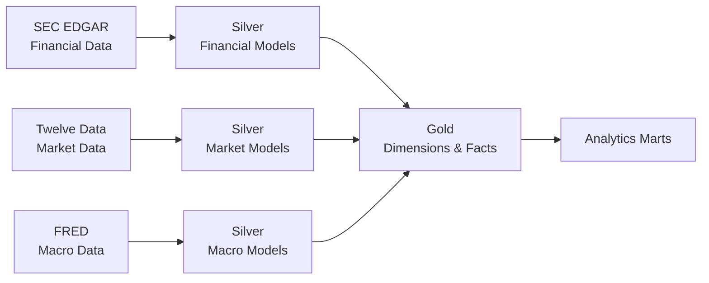

# Data Model

## Overview

FinStream separates source-preserving data from standardized and analytical models:

- **Bronze** preserves source data with minimal interpretation.
- **Silver** contains cleaned, typed, standardized, deduplicated, source-aligned models.
- **Gold** contains analytics-ready dimensions, facts, and marts.

Bronze is upstream raw storage and is not the final analytical schema.

## Data Model Flow

Bronze storage exists upstream of these models and preserves original source payloads before standardization.

## Modeling Principles

- Every fact and mart must have an explicitly documented grain.
- Stable source identifiers must remain available for traceability.
- Ticker symbols must not serve as the sole long-term company identity.
- Silver models retain source-specific metadata when needed for traceability; Gold models normalize business meaning.
- Financial, market, and macroeconomic data must not be assumed to share a frequency.
- Monthly or quarterly data must not be silently forced onto a daily grain.
- Derived metrics require documented definitions.
- Source differences must not be hidden in ways that make analytical results misleading.

## Silver Models

Silver models remain close to their source domains while applying consistent naming, types, and duplicate handling.

### `stg_market_prices`

> Grain: One row per symbol per trading date.

Typical logical fields include symbol, trading date, open, high, low, close, volume, source, and ingestion metadata.

### `stg_financial_facts`

This model represents normalized SEC XBRL fact occurrences.

> Grain: One reported financial fact occurrence from one SEC filing context.

It retains traceability information including company or CIK, taxonomy, source concept, unit, reporting period, filing form, filing date, accession information, and available fiscal metadata. Similarly named XBRL concepts from different companies are not assumed to be equivalent. Final canonical SEC concept mappings are deferred.

### `stg_macro_observations`

> Grain: One retrieved observation for a FRED series, observation date, and source real-time context.

This model retains series ID, observation date, value, available source real-time metadata, and other source metadata required for interpretation. V1 does not claim complete historical vintage coverage unless ingestion explicitly retrieves that history.

## Gold Dimensions

### `dim_company`

This dimension represents companies shared between SEC financial and market data.

> Grain: One row per company identified by SEC CIK.

Logical attributes may include CIK, current ticker, and company name. CIK is the primary stable business identity; ticker is not the sole permanent identifier because ticker symbols may change. The configured current ticker-to-CIK mapping is sufficient for V1, without a full Slowly Changing Dimension implementation.

### `dim_date`

> Grain: One row per calendar date.

This dimension provides reusable calendar attributes. Market facts occur only on trading dates, financial facts retain reporting-period semantics, and macroeconomic facts retain observation-date semantics. These dates are not interchangeable.

### `dim_macro_series`

> Grain: One row per FRED series ID.

Logical attributes may include series ID, title, frequency, units, and seasonal-adjustment metadata.

### `dim_financial_metric`

This dimension represents canonical FinStream financial metrics for cross-company analytics, conceptually including revenue, net income, assets, liabilities, cash, stockholders' equity, and earnings per share.

> Grain: One row per canonical FinStream financial metric.

SEC taxonomy concepts must eventually be mapped explicitly to these metrics. The final mapping structure and mappings are deferred.

## Gold Facts

### `fact_market_daily`

> Grain: One row per company per trading date.

Measures are open, high, low, close, and volume. The model must prevent duplicate company and trading-date observations.

### `fact_financial_reported`

This fact represents standardized values reported through SEC filings.

> Grain: One standardized financial fact for a company, reporting context, filing, and canonical financial metric.

It preserves enough information to distinguish filing identity, original and amended filings where applicable, reporting period, fiscal context, and relevant units. Company fiscal periods must not be forced into calendar quarters when fiscal calendars differ.

### `fact_macro_observation`

> Grain: One current canonical value per macro series per observation date.

Silver retains available source real-time metadata. If full revision or vintage analytics are later required, a dedicated vintage-aware model must be introduced rather than silently changing the meaning of `fact_macro_observation`.

## Analytics Marts

Potential initial logical outputs include:

- `mart_company_daily_performance`
- `mart_company_financial_growth`
- `mart_market_macro`

These are planned models, not implemented models. Each mart must document its grain and calculation rules before implementation. Cross-domain marts must also define temporal alignment explicitly; monthly or quarterly macroeconomic observations must not be copied or joined to every daily market row without a documented rule such as as-of or period-based alignment.

## Keys and Identity

Natural source identifiers remain available for traceability:

| Entity | Source identity |
| --- | --- |
| SEC company | CIK |
| Market observation | Ticker or symbol |
| FRED series | Series ID |
| SEC filing | Accession information |

Gold dimensions may later use surrogate keys for warehouse relationships, but they do not replace source identifiers. Exact database key types and constraints are deferred.

## Data Quality Expectations

### Market Data

- Symbol and trading date are required.
- Symbol plus trading date is unique.
- High is greater than or equal to low, open, and close.
- Low is less than or equal to open and close.
- Volume is non-negative when supplied.

### Financial Data

- Company identity, reporting-period context, and filing identity are required.
- A source concept or mapped metric is required.
- Units are required where applicable.
- Not every financial metric is expected to exist for every company.

### Macroeconomic Data

- Series identity and observation date are required.
- Valid source missing-value markers must be handled correctly.
- A legitimate no-new-data result must not automatically be treated as pipeline failure.
- Revision metadata must not be discarded when intentionally retrieved.

These are logical expectations, not implemented dbt tests.

## Data Model Boundaries

This document owns logical Silver models, logical Gold dimensions and facts, grains, analytical relationships, identity strategy, important temporal modeling rules, and modeling expectations for cross-domain analytics.

It does not own provider access, authentication, update behavior, or external limitations (`DATA_SOURCES.md`); component responsibilities or system data flow (`ARCHITECTURE.md`); goals, scope, requirements, or non-goals (`PROJECT_REQUIREMENTS.md`); or implementation sequence (`ROADMAP.md`).

SQL DDL, exact PostgreSQL schemas, exact data types, indexes, physical partitioning, dbt implementation, and exact column-level schemas are deferred to later implementation work.
