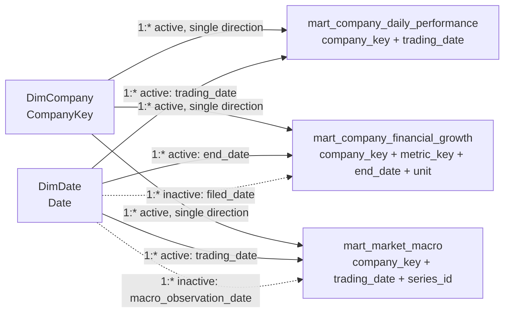

# Power BI Architecture and Runtime Contract

## Scope and Ownership

This document defines the implemented Power BI connection, semantic-model, and
dashboard contract for FinStream's PostgreSQL/dbt analytics layer. The
versioned source of truth is the Power BI Project at `powerbi/FinStream.pbip`;
the repository does not use a `.pbix` file as a parallel source of truth.

The analytical source of truth is PostgreSQL plus dbt. Power BI consumes the
curated analytics marts and owns presentation-level aggregation, filtering,
interaction, and visualization. Shared transformations, company-identity
mapping, derived market and financial metrics, and cross-domain temporal
alignment remain in dbt; they must not be reimplemented in Power Query or DAX.

## Approved Power BI Relations

The current dbt profile makes the target schema environment-configurable through
`DBT_POSTGRES_SCHEMA`. The current generated dbt manifest resolves the approved
relations as views in database `finstream`, schema `analytics`. A deployment
must use the schema selected by the dbt profile; it must not assume that every
environment is named `analytics`.

| Approved relation | Current resolved relation | Purpose and grain | Logical key | Upstream dbt dependencies |
| --- | --- | --- | --- | --- |
| `mart_company_daily_performance` | `"finstream"."analytics"."mart_company_daily_performance"` | Daily company equity performance. One row per `company_key`, `trading_date`. | (`company_key`, `trading_date`) | `company_identity_mapping`, `fact_market_daily`, `dim_company` |
| `mart_company_financial_growth` | `"finstream"."analytics"."mart_company_financial_growth"` | Representative annual reported financial values and growth. One row per `company_key`, `metric_key`, `end_date`, `unit`. | (`company_key`, `metric_key`, `end_date`, `unit`) | `fact_financial_reported`, `company_identity_mapping`, `dim_financial_metric` |
| `mart_market_macro` | `"finstream"."analytics"."mart_market_macro"` | Daily company market observations aligned to each configured macro series. One row per `company_key`, `trading_date`, `series_id`. | (`company_key`, `trading_date`, `series_id`) | `mart_company_daily_performance`, `dim_macro_series`, `fact_macro_observation` |

The dependencies listed above are implementation lineage, not additional Power
BI tables to load. The three mart relations are dbt models with the default view
materialization in the current project.

### `mart_company_daily_performance`

Important dimensions are `company_key`, `current_ticker`, `current_cik`,
`company_name`, and `trading_date`. Measures are `open`, `high`, `low`, `close`,
`volume`, `previous_close`, `daily_change`, and `daily_return`. `volume` is
nullable under the upstream source contract; `previous_close`, `daily_change`,
and `daily_return` are null for the earliest available trading session (and
`daily_return` is also null when the prior close is zero). `daily_return` is a
ratio, not a 0--100 value. The current registrant mapping is applied upstream,
so predecessor registrants do not duplicate market sessions.

### `mart_company_financial_growth`

Important dimensions are `company_key`, `current_ticker`, `source_cik`,
`metric_key`, `metric_name`, `period_type`, `taxonomy`, `concept`, `unit`,
`fiscal_year`, `start_date`, `end_date`, `form`, `filed_date`, and
`accession_number`. Measures are `current_value`, `previous_value`,
`absolute_change`, and `growth_rate`.

This mart contains representative annual `10-K` or `10-K/A`, `FY` facts only.
It retains native fiscal calendars, source CIK provenance, and units; it does
not perform currency conversion or calendar coercion. `start_date` is null for
instant metrics. Previous-period and derived-growth fields are null when no
eligible consecutive annual comparison exists; `growth_rate` is also null when
the previous value is zero. `growth_rate` is a ratio, not a 0--100 value.

### `mart_market_macro`

Important dimensions are `company_key`, `current_ticker`, `current_cik`,
`company_name`, `trading_date`, and `series_id`. Measures are `market_close`,
`market_volume`, `macro_value`, and `macro_age_days`; the relevant macro date is
`macro_observation_date`. `market_volume` is nullable. All three macro-alignment
fields are null when no eligible macro observation exists, and a null
`macro_value` can also be a legitimate source value.

This is a retrospective **current-vintage** mart. It aligns by macro
observation/reference date, selecting the latest eligible observation on or
before each trading date, and may reuse that observation across later trading
dates. It does not interpolate, alter, or impute macro values. This alignment
does not establish historical publication or release availability, so it must
not be described as publication-time-aware or no-lookahead-safe. Historical
information-availability analysis requires a future vintage/release-aware source
such as ALFRED.

## Exposure Boundary

Power BI should load only the three approved mart relations above. It should not
normally query these layers directly:

- Bronze JSON and Parquet artifacts under `data/`.
- PostgreSQL `source_data` ingestion, source-domain, and provenance/control
  tables, including `ingestion_runs`.
- dbt Silver staging models (`stg_market_prices`, `stg_financial_facts`, and
  `stg_macro_observations`).
- dbt Gold dimensions and facts, dbt seeds, or any other internal relation.

This boundary preserves a single shared definition for identities, metrics, and
temporal alignment. It does not introduce a duplicate Power BI mart. If a later
dashboard cannot be supported by these marts, document the missing analytical
requirement and evaluate it upstream in dbt rather than silently transforming
the data in Power BI.

## Connection Contract

### Docker/local development

Start the documented local Compose runtime with a local, gitignored
`.env.docker` created from `.env.docker.example`. The `postgres` service maps
container port `5432` to `POSTGRES_HOST_PORT`, whose documented default/example
is `5433`.

| Caller | Server / host | Port | Database | Credentials |
| --- | --- | ---: | --- | --- |
| Power BI Desktop on the Windows host | `localhost` | `POSTGRES_HOST_PORT` (for example, `5433`) | `FINSTREAM_POSTGRES_DB` (example: `finstream`) | Database user/password from local configuration; never commit them. |
| A container on the Compose network | `postgres` | `5432` | The configured FinStream database | Its explicitly supplied container credentials. |

`postgres:5432` is Compose-internal DNS and is not a valid server name for
Power BI Desktop running on Windows. Conversely, a Compose container must not
use the host-mapped Power BI endpoint as an implicit substitute for its internal
database connection.

For the host/Desktop connection, use **Get data** > **PostgreSQL database** and
enter `localhost:<POSTGRES_HOST_PORT>` as the server and the configured
FinStream database as the database. Use the **Database** authentication option
and enter the locally configured FinStream database user and password only in
Power BI's credential prompt. In Navigator, select the dbt target schema (the
current local artifact is `analytics`) and select only the three approved marts.

Before connecting, complete the existing data pipeline and dbt build for the
target environment. This contract does not start Docker automatically or create
database users, schemas, or access grants.

### General deployment

For a remote PostgreSQL deployment, obtain the deployment's server name, port,
database name, dbt target schema, TLS requirements, and a read-only credential
whose access is limited to the three approved mart relations. Use the same
approved relation names and mode decision; do not replace them with a direct
connection to an internal layer. If reports are later published to Power BI
Service and PostgreSQL is not directly reachable by the service, the required
gateway/network configuration is a separate deployment decision and is outside
this document.

## Connectivity Mode

**Default: Import.** The PostgreSQL connector supports both Import and
DirectQuery, but Import is the appropriate initial mode for FinStream's
batch-oriented local architecture. It gives reproducible report data after a
known dbt run, keeps routine interactive work independent of an always-running
local PostgreSQL container, and adds no gateway, performance-tuning, or
DirectQuery operational requirements.

Use DirectQuery only after a concrete requirement for each visual to query the
currently running PostgreSQL instance is established and its connection,
performance, refresh, and deployment implications are separately validated.
DirectQuery does not move transformations into Power BI and does not remove the
need to run dbt upstream. No refresh schedule or cloud infrastructure is defined
by this decision.

## Type and Nullability Review

The exposed mart SQL derives its types from the PostgreSQL source contract:
market prices use `NUMERIC(38,18)` and nullable `BIGINT` volume; reported SEC
financial values and FRED macro values use `NUMERIC(76,30)`; dates are
PostgreSQL `DATE`; and financial fiscal years are nullable `INTEGER`.

| PostgreSQL / mart category | Power BI guidance | Compatibility finding |
| --- | --- | --- |
| `DATE`: trading, observation, reporting, filing, and prior-period dates | Verify a Power Query **Date** type. Do not use a date as a text field. | Compatible. The exposed marts do not contain timestamps. |
| `NUMERIC(38,18)` and `NUMERIC(76,30)`: price, financial, macro, and derived ratio values | Review imported values as **Decimal number**; format `daily_return` and `growth_rate` as Percentage without multiplying by 100. | Potential precision issue: Power BI Decimal number is floating-point and represents at most 15 digits of precision. Validate business-required display and aggregate precision; do not change PostgreSQL types or use these values as equality/join keys for convenience. |
| `BIGINT`: `volume` and integer date-age output | Verify **Whole number** where values fit the report's intended use. | Compatible, with legitimate null volume preserved as blank. |
| `INTEGER`: `fiscal_year` and `macro_age_days` | Verify **Whole number**. | Compatible; `fiscal_year` may be blank. |
| `TEXT`: company keys, tickers, CIKs, metric keys, taxonomy, concepts, units, forms, and accession numbers | Keep as **Text**. In particular, CIKs and accession numbers are identifiers, not numeric measures. | Compatible; preserve leading zeros and never aggregate identifiers. |
| Nullable derived/alignment fields | Leave nulls as blanks unless a report requirement explicitly defines another display treatment. | Null is meaningful for unavailable prior periods, zero denominators, unavailable eligible macro observations, and legitimate upstream values. Do not coalesce it into zero. |

The PostgreSQL connector may fail before a post-Navigation Power Query type
step when a mart value uses a PostgreSQL `NUMERIC` precision or scale that the
provider cannot materialize as `System.Decimal`. In that case, keep the
PostgreSQL/dbt numeric contract authoritative and use a read-only native SQL
compatibility projection over the same approved mart. The projection must use
an explicit column list, cast only the incompatible value columns to `double
precision`, preserve their original aliases, and leave the mart grain,
business logic, nulls, and non-cast columns unchanged. Do not cast identifiers
or relationship keys, and do not recalculate a mart-derived value in the BI
query. Retain the normal Navigator import for a mart that previews correctly.

The resulting Power BI Decimal Number is an ingestion representation, not a
claim that every PostgreSQL source digit is preserved. Validate row counts,
grain, null counts, non-cast values, and observed cast differences before
loading; record source, model, and display precision separately.

Power BI Desktop normally includes the PostgreSQL provider in currently supported
versions. Verify detected types in Power Query before loading because automatic
type detection is not a semantic contract. See Microsoft's [PostgreSQL connector
guidance](https://learn.microsoft.com/en-us/power-query/connectors/postgresql)
and [Power BI data-type guidance](https://learn.microsoft.com/en-us/power-bi/connect-data/desktop-data-types).

## Basic Verification

1. Confirm the local PostgreSQL service is healthy and that the configured dbt
   target has been built successfully.
2. Connect with the host/Desktop endpoint, database, and Database credentials
   above.
3. In Navigator, confirm the selected schema exposes all three approved mart
   relations and load only those relations in Import mode.
4. In Power Query, confirm identifier, Date, numeric, and nullable fields have
   the interpretations in the type review. Confirm the mart keys are unique at
   their documented grains rather than creating an unapproved relationship.
5. Load a small model and verify that the values, row semantics, and nulls are
   consistent with the upstream dbt mart documentation. Do not treat a
   successful connection as evidence that an unrun dbt pipeline is current.

## Repository Hygiene

Version the canonical `.pbip`, PBIR report definition, and TMDL semantic-model
definition so report and model changes remain reviewable. Do not commit a
parallel `.pbix`, temporary project, local Power BI cache, local
settings, credentials, or connection secrets. In particular,
`.pbi/localSettings.json` and `.pbi/cache.abf` are local/generated artifacts;
the project source formats themselves must not be broadly ignored.

## Semantic Model Contract

### Model Shape and Table Roles

Use a limited constellation model: two Power BI semantic dimensions filter the
three imported analytics marts. The dimensions are Power BI model tables derived
only from the approved marts during refresh; they are not additional PostgreSQL
relations and do not widen the BI exposure boundary.

| Power BI table | Role | Source and key | Notes |
| --- | --- | --- | --- |
| `DimCompany` | Shared semantic dimension | Derived from the mart `company_key` values; key: `CompanyKey`. | `company_key` is the relationship key. `current_ticker`, `current_cik`, and `company_name` are descriptive attributes, not alternate keys. |
| `DimDate` | Shared calendar dimension | Derived from the documented mart-level dates; key: `Date`. | One row per calendar date, including non-trading dates. |
| `mart_company_daily_performance` | Market fact | (`company_key`, `trading_date`) | Daily company market observation and upstream daily derived metrics. |
| `mart_company_financial_growth` | Financial fact | (`company_key`, `metric_key`, `end_date`, `unit`) | Representative annual SEC financial fact and upstream growth metrics. `MetricShortName` is a presentation-only calculated column; `metric_key` remains canonical and `metric_name` remains retained. |
| `mart_market_macro` | Market--macro fact | (`company_key`, `trading_date`, `series_id`) | One market trading row repeated for every configured macro series, with a reference-date-aligned macro observation. |

Do not create direct relationships between any pair of marts. In particular,
`mart_market_macro` is not a child of `mart_company_daily_performance` in the
Power BI model even though it depends on that dbt model: every daily market value
in the market--macro mart is repeated once per `series_id`, so a fact-to-fact
relationship or combined aggregation would create ambiguous and duplicated
results.

`metric_key`, `metric_name`, `MetricShortName`, `period_type`, `unit`, and `series_id` remain
dimension-like attributes on their single applicable mart. Creating separate
Power BI metric or macro-series dimensions would add tables and relationships
without improving the current three-mart contract.



### Mart Semantic Profiles

| Mart | Dimension-like fields | Fact-like and upstream-derived fields | Identifier and context fields | Filtering, drill-down, and null semantics |
| --- | --- | --- | --- | --- |
| `mart_company_daily_performance` | `company_key`, `current_ticker`, `current_cik`, `company_name`, `trading_date` | `open`, `high`, `low`, `close`, nullable `volume`, `previous_close`, `daily_change`, `daily_return` | `company_key` and `current_cik` are identifiers; prices and return are not keys. | Filter by company and trading date; use ticker/name/CIK for drill-down or tooltip. `previous_close`, `daily_change`, and `daily_return` are null for the first available session; return is also null for a zero prior close. |
| `mart_company_financial_growth` | `company_key`, `current_ticker`, `metric_key`, `metric_name`, `period_type`, `unit`, `fiscal_year`, `taxonomy`, `concept`, `form`, `end_date`, `filed_date` | `current_value`, `previous_value`, `absolute_change`, `growth_rate` | `source_cik` and `accession_number` are filing provenance identifiers. `start_date` and `previous_end_date` are period context, not a daily event date. | Filter by company, metric, unit, period type, fiscal year, form, and end date; retain provenance in drill-through/tooltip. `start_date` is null for instant metrics. Prior-period and derived fields are null when no eligible consecutive annual comparison exists; growth is also null for zero prior value. |
| `mart_market_macro` | `company_key`, `current_ticker`, `current_cik`, `company_name`, `trading_date`, `series_id`, `macro_observation_date` | `market_close`, nullable `market_volume`, nullable `macro_value`, nullable `macro_age_days` | `company_key`, `current_cik`, and `series_id` identify context. `macro_observation_date` is reference-date context, not a release date. | Filter by company, market trading date, and series. Use macro observation date and age in tooltip/context. Macro alignment fields are all null when no eligible observation exists; `macro_value` can also be a legitimate source null. |

The dbt tests establish the listed mart grains. The current model treats every
listed logical key as unique only at its full grain; no single price, value,
ticker, CIK, date, or display name is a standalone fact key.

### Company Identity Strategy

`CompanyKey` maps directly to the mart column `company_key` and is the sole
shared relationship key. It is the durable analytical identity used across all
three marts. `current_ticker` is a descriptive current market symbol, not the
key: ticker symbols are not permanent identities. `source_cik` in the financial
mart is the filing entity's provenance and must not be substituted for the
market marts' `current_cik`; predecessor and successor registrants can share an
analytical `company_key`.

Build the `DimCompany` base from distinct `company_key` values only, creating
exactly one row for each key. Then enrich that row with the actual mart
attributes `current_ticker`, `current_cik`, and `company_name` where available.
Each descriptive attribute must resolve to at most one canonical value per
`company_key`; a conflict is a validation problem, not a reason to create a
second dimension row or silently choose a value. Do not use a broad `DISTINCT`
over `company_key` plus descriptive attributes. Do not use financial
`source_cik` to fill a missing `current_cik`, and do not use a company name as a
key.

Before creating the one-to-many relationships, validate that the resulting
`DimCompany[CompanyKey]` has exactly one row per key and one current ticker per
key. The upstream identity-mapping invariant already requires exactly one
current registrant per `company_key`, a current ticker owned by one current
company, and a source CIK owned by one analytical company. The dimension build
must reject inconsistent descriptive attributes rather than silently choosing a
value. If a financial-mart company has no daily/macro identity enrichment, keep
those descriptive attributes blank and record the coverage issue; do not query
an internal dimension to fill it.

### Date Strategy

Create a dedicated `DimDate` table in the Power BI model; do not rely on Power
BI Auto date/time tables. The canonical key is a Date-typed `Date` column with
one row for every calendar date from the minimum through the maximum non-null
date represented by the exposed marts. Its refresh-time bounds are the union of:

- daily and market--macro `trading_date`;
- financial `start_date`, `end_date`, `previous_end_date`, and `filed_date`; and
- market--macro `macro_observation_date`.

`fiscal_year` is an SEC-provided categorical attribute and does not define the
calendar range. The table should contain only `Date`, `CalendarYear`,
`YearMonth`, `YearMonthSort`, `MonthNumber`, `MonthName`, `QuarterNumber`,
`YearQuarter`, `YearQuarterSort`, `WeekdayNumber`, and `WeekdayName`.
`YearMonthSort` is numeric `YYYYMM` (`CalendarYear * 100 + MonthNumber`), and
`YearQuarterSort` is numeric `YYYYQ` (`CalendarYear * 10 + QuarterNumber`). In
Power BI, sort `MonthName` by `MonthNumber`, `YearMonth` by `YearMonthSort`,
`YearQuarter` by `YearQuarterSort`, and `WeekdayName` by `WeekdayNumber`. Do not
sort `YearMonth` by raw `Date`, because one YearMonth label has multiple dates.
The existing dbt `dim_date` validates the same one-row-per-day calendar
principle upstream, but it remains outside the Power BI source boundary.

The active relationships use the primary event date of each fact: market
`trading_date`, financial reporting `end_date`, and market--macro
`trading_date`. A common Date slicer therefore filters different date roles in
different facts; it does not assert that a financial value was filed, known, or
available on the matching market date. Financial `filed_date` and macro
`macro_observation_date` have inactive relationships for a future explicitly
defined filing-date or reference-date measure. `start_date` and
`previous_end_date` are intentionally not related: they are period-boundary
context, not competing active reporting events.

### Relationship Contract

| From (one side) | To (many side) | Cardinality and status | Cross-filter direction | Justification and guardrail |
| --- | --- | --- | --- | --- |
| `DimCompany[CompanyKey]` | `mart_company_daily_performance[company_key]` | One-to-many, active | Single, dimension to fact | The daily mart grain starts with `company_key`; filter only from the conformed company dimension. |
| `DimCompany[CompanyKey]` | `mart_company_financial_growth[company_key]` | One-to-many, active | Single, dimension to fact | The financial mart uses the same durable company identity while retaining `source_cik` as provenance. |
| `DimCompany[CompanyKey]` | `mart_market_macro[company_key]` | One-to-many, active | Single, dimension to fact | The macro mart inherits the daily mart's company identity. |
| `DimDate[Date]` | `mart_company_daily_performance[trading_date]` | One-to-many, active | Single, dimension to fact | The primary market-session date. |
| `DimDate[Date]` | `mart_company_financial_growth[end_date]` | One-to-many, active | Single, dimension to fact | The primary reported financial period-end date; it is not a market session or filing-availability claim. |
| `DimDate[Date]` | `mart_market_macro[trading_date]` | One-to-many, active | Single, dimension to fact | The market-session date that defines the mart row. |
| `DimDate[Date]` | `mart_company_financial_growth[filed_date]` | One-to-many, inactive | Single, dimension to fact | Reserved for an explicit future filing-date measure; it must not compete with the active period-end role. |
| `DimDate[Date]` | `mart_market_macro[macro_observation_date]` | One-to-many, inactive | Single, dimension to fact | Reserved for explicit reference-date analysis; it is not a publication/release date. |

There are intentionally no relationships between marts, no relationship on
`current_ticker`, `current_cik`, `source_cik`, `metric_key`, `unit`, or
`series_id`, and no bidirectional or many-to-many relationship. These choices
leave one unambiguous dimension-to-fact filter path per active role.

### Aggregation Contract

Use explicit measures for report calculations. Some imported numeric columns
retain Power BI's automatically generated `Summarize by: Sum` metadata; that
metadata is not semantic approval to use an implicit measure. The curated
visuals use guarded explicit measures or row-level detail tables with totals
disabled.

| Mart and fields | Classification | Required report behavior | Constraint |
| --- | --- | --- | --- |
| Daily `open`, `high`, `low`, `close`, `previous_close` | Non-additive prices | Use guarded explicit measures or row-level detail; do not use an implicit Sum. | A price is not additive across dates or companies. |
| Daily `volume` | Additive only within the daily mart | Sum is permitted for filtered companies and trading dates. | Preserve null as blank; never substitute `market_volume` from the macro mart. |
| Daily `daily_change`, `daily_return` | Derived, non-additive | Do not summarize; measure-only. | They are already upstream calculations for one session and company. |
| Financial `current_value`, `previous_value`, `absolute_change` | Conditionally additive facts | Use the guarded measures or row-level detail; do not use an implicit Sum in report visuals. | Never sum mixed metrics, currencies/units, companies, or periods by accident. |
| Financial `growth_rate` | Derived ratio | Do not summarize; measure-only. | A sum or average of growth rates is not a universally meaningful growth calculation. |
| Financial `fiscal_year`, all dates, and filing/identity fields | Attributes or identifiers | Do not summarize. | Fiscal year is not a measure; dates and identifiers must not be summed. |
| Market--macro `market_close`, `market_volume` | Repeated market facts, non-additive in this mart | Do not summarize; use the daily mart for market-price or volume aggregation. | Each market value repeats for every `series_id`. |
| Market--macro `macro_value`, `macro_age_days` | Series-specific reference-date facts | Use guarded explicit measures or row-level detail after selecting one `series_id`. | Series frequencies, units, nulls, and reference-date alignment differ. |
| All keys and provenance: company/ticker/CIK/metric/taxonomy/concept/unit/form/accession/series identifiers | Identifier or context | Do not summarize. | They support filtering, labels, drill-down, or tooltip context only. |

### Ratio, Measure, and Precision Boundaries

`daily_return` is stored upstream as `(close / previous_close) - 1.0` and
`growth_rate` as `(current_value - previous_value) / ABS(previous_value)`.
Both are decimal ratios: format them as Percentage in Power BI and do not
multiply values by 100. Neither is a candidate for implicit Sum, average, or a
duplicated DAX implementation.

dbt/PostgreSQL continues to own normalization, joins, model grain, company
identity mapping, market OHLCV derivation, financial representative-fact and
growth logic, daily-return logic, and market--macro alignment. Power BI/DAX
owns only presentation calculations that depend on the selected filter context,
such as selected-period, latest-visible-value, and guarded display measures.
Those measures use the relationships and aggregation rules above and do not
reproduce upstream mart business logic.

The source contract retains `NUMERIC(38,18)` market prices and
`NUMERIC(76,30)` financial and macro values. The latter values and any derived
financial ratios can exceed the effective 15-digit precision of Power BI Decimal
number; high-precision market and derived values may also require display-rounding
verification. Do not make numeric values relationship keys, compare them for
semantic equality, or reduce PostgreSQL precision for Power BI convenience.

### Financial and Market--Macro Time Safeguards

The financial mart contains representative annual `10-K` or `10-K/A`, `FY`
facts. Its `end_date` is a native fiscal reporting-period end, its `filed_date`
is the SEC filing date, and its `start_date` is populated only for duration
metrics. It does not establish a daily financial series, coerce fiscal calendars
to calendar quarters, convert currencies/units, or equate financial period end
with a market trading date.

`mart_market_macro` remains retrospective and **current-vintage**. It selects
the latest eligible macro observation by observation/reference date on or before
each market trading date and may repeat that observation across later trading
dates. It does not interpolate, alter, or impute macro values; does not establish
what was historically known on a trading date; is not publication-time-aware or
vintage-aware; and is not guaranteed no-lookahead-safe. `macro_age_days` is a
reference-date age, not a release or availability lag. Historical
information-availability analysis requires future vintage/release-aware data,
such as ALFRED or equivalent release metadata.

### Power BI Auto-Behavior Conventions

- Disable Auto date/time for this model. `DimDate` is the documented shared
  calendar; hidden per-column date tables would create inconsistent date logic.
- Do not accept automatically detected relationships. Create only the eight
  relationships in the contract, with their documented active state and
  single-direction filtering.
- Do not rely on automatically generated summarization metadata for analytical
  meaning. Curated visuals use explicit measures for prices, returns, growth,
  macro values, and financial values; detail tables remain row-level and do not
  expose totals across incompatible contexts.
- Apply the documented sort-by columns to calendar labels; do not rely on
  alphabetical month, quarter, or weekday ordering.

### Model Validation Checks

On refresh, validate the distinct `DimCompany` key and attributes, date-range
coverage, all one-to-many relationships, inactive date roles, and the absence
of direct mart relationships. Confirm that market values are sourced from the
daily mart for aggregation and that financial values are never combined across
incompatible metrics or units. These checks do not authorize changes to dbt or
the addition of lower-layer sources.

## Market Performance Dashboard

### Purpose and Source Boundary

The Market Performance page answers how a selected company's observed market
price, daily price return, and trading volume changed over a selected trading
period. It also supports a close-to-close price-return comparison across
companies for one common date range. It does not provide financial-statement or
SEC filing analysis, macroeconomic interpretation, forecasting, portfolio
analysis, trading recommendations, or investment advice.

`analytics.mart_company_daily_performance` is the page's only fact source. Its
grain and logical key are one row per (`company_key`, `trading_date`). Rows are
ordered chronologically within a company when deriving prior-session values;
`previous_close` is the close from the immediately preceding available market
observation for that company, not the previous calendar date.

| Field group | Actual mart columns | Dashboard use and constraints |
| --- | --- | --- |
| Company identity and labels | `company_key`, `current_ticker`, `current_cik`, `company_name` | Filter through `DimCompany[CompanyKey]`; show ticker/name to users. `current_cik` is identity context for validation or tooltip use, not a primary slicer. |
| Trading date | `trading_date` | Related actively from `DimDate[Date]`; use for the date range, daily axes, tooltips, and detail sorting. It is a market-session date. |
| Session prices | `open`, `high`, `low`, `close` | Non-additive values for daily points, paired first/latest values, range statistics, tooltips, and the detail table. Never sum them. |
| Volume | nullable `volume` | Session trading volume. It is additive only in this daily mart at compatible company/date context; preserve source nulls as blanks. |
| Prior-session outputs | nullable `previous_close`, `daily_change`, `daily_return` | Upstream outputs for the immediately preceding available company observation. Use the values on the selected latest row; do not reproduce their business logic in DAX. |

The source path describes `close` only as the source closing price and contains
no adjusted-close, split, dividend, currency, or total-shareholder-return field.
Accordingly, `Selected Period Return` below is explicitly a close-to-close
price return over the visible observations. It must not be described as an
adjusted, dividend-adjusted, or total shareholder return. The mart also exposes
no benchmark, rolling return, cumulative-return series, moving average, or
volatility metric. Those gaps must not be filled from a lower-layer relation.

### Page Filters and Company Context

- Use a searchable Company slicer from `DimCompany`, displaying
  `current_ticker` with `company_name` as descriptive context while filtering
  facts through `DimCompany[CompanyKey]`. Do not expose the key or CIK as the
  primary label.
- Allow zero, one, or multiple company selections so the normalized comparison
  visual remains useful. Save the report's ordinary viewing state with one
  company selected. Price-specific cards and time-series measures return blank
  unless the effective context contains exactly one `CompanyKey`.
- Use a Between date slicer on the Date-typed `DimDate[Date]`. It establishes
  one inclusive range for every visual. Non-trading calendar dates may occur in
  the selected interval but do not create or impute market rows.
- Add no redundant ticker, CIK, price, or derived-return slicer. Visual-level
  Top N filters are not part of this contract.

### Market Measures

Create a Power BI-only table named `_Measures` and place all page measures in
it. This table is semantic-model organization only: it has no PostgreSQL
counterpart, contains no business data, and has no relationships. Keep source
columns on `mart_company_daily_performance`, with their default summarization
rules from the semantic model contract.

The point measures below are valid only where the visual provides one company
and one trading date. `SELECTEDVALUE` prevents a visual from silently adding or
averaging several prices, returns, or volumes.

```DAX
Close :=
IF (
    HASONEVALUE ( 'DimCompany'[CompanyKey] ),
    SELECTEDVALUE ( 'mart_company_daily_performance'[close] )
)

Daily Return :=
IF (
    HASONEVALUE ( 'DimCompany'[CompanyKey] ),
    SELECTEDVALUE ( 'mart_company_daily_performance'[daily_return] )
)

Daily Volume :=
IF (
    HASONEVALUE ( 'DimCompany'[CompanyKey] ),
    SELECTEDVALUE ( 'mart_company_daily_performance'[volume] )
)
```

The latest-date family preserves the date-value pairing. The maximum is taken
from eligible mart rows after the current company/date filters; the value is
then read from that same row. `Previous Trading Close`, `Daily Change`, and
`Daily Change %` deliberately select the mart outputs paired to the latest row.
The upstream `previous_close` can refer to an observation before the slicer's
start date when that observation is the true prior available session.

```DAX
Latest Trading Date :=
IF (
    HASONEVALUE ( 'DimCompany'[CompanyKey] ),
    MAX ( 'mart_company_daily_performance'[trading_date] )
)

Latest Close :=
VAR LatestDate = [Latest Trading Date]
RETURN
    IF (
        NOT ISBLANK ( LatestDate ),
        CALCULATE (
            SELECTEDVALUE ( 'mart_company_daily_performance'[close] ),
            KEEPFILTERS (
                'mart_company_daily_performance'[trading_date] = LatestDate
            )
        )
    )

Previous Trading Close :=
VAR LatestDate = [Latest Trading Date]
RETURN
    IF (
        NOT ISBLANK ( LatestDate ),
        CALCULATE (
            SELECTEDVALUE ( 'mart_company_daily_performance'[previous_close] ),
            KEEPFILTERS (
                'mart_company_daily_performance'[trading_date] = LatestDate
            )
        )
    )

Daily Change :=
VAR LatestDate = [Latest Trading Date]
RETURN
    IF (
        NOT ISBLANK ( LatestDate ),
        CALCULATE (
            SELECTEDVALUE ( 'mart_company_daily_performance'[daily_change] ),
            KEEPFILTERS (
                'mart_company_daily_performance'[trading_date] = LatestDate
            )
        )
    )

Daily Change % :=
VAR LatestDate = [Latest Trading Date]
RETURN
    IF (
        NOT ISBLANK ( LatestDate ),
        CALCULATE (
            SELECTEDVALUE ( 'mart_company_daily_performance'[daily_return] ),
            KEEPFILTERS (
                'mart_company_daily_performance'[trading_date] = LatestDate
            )
        )
    )
```

The selected-period measures pair each endpoint with the first or last
available market row inside the current filter context. A period return needs
at least two eligible trading dates and a nonzero start close.

```DAX
Period Start Close :=
VAR SingleCompany = HASONEVALUE ( 'DimCompany'[CompanyKey] )
VAR StartDate =
    IF (
        SingleCompany,
        MIN ( 'mart_company_daily_performance'[trading_date] )
    )
RETURN
    IF (
        SingleCompany && NOT ISBLANK ( StartDate ),
        CALCULATE (
            SELECTEDVALUE ( 'mart_company_daily_performance'[close] ),
            KEEPFILTERS (
                'mart_company_daily_performance'[trading_date] = StartDate
            )
        )
    )

Period End Close :=
[Latest Close]

Selected Period Return :=
VAR DayCount = [Trading Days]
VAR StartClose = [Period Start Close]
VAR EndClose = [Period End Close]
RETURN
    IF (
        DayCount >= 2
            && NOT ISBLANK ( StartClose )
            && NOT ISBLANK ( EndClose )
            && StartClose <> 0,
        DIVIDE ( EndClose, StartClose ) - 1
    )
```

Range statistics remain scoped to exactly one company. `Average Daily Return`
is the arithmetic mean of nonblank upstream daily ratios; it is not a compound
return, and summing `daily_return` is prohibited.

```DAX
Average Daily Return :=
IF (
    HASONEVALUE ( 'DimCompany'[CompanyKey] ),
    AVERAGE ( 'mart_company_daily_performance'[daily_return] )
)

Minimum Close :=
IF (
    HASONEVALUE ( 'DimCompany'[CompanyKey] ),
    MIN ( 'mart_company_daily_performance'[close] )
)

Maximum Close :=
IF (
    HASONEVALUE ( 'DimCompany'[CompanyKey] ),
    MAX ( 'mart_company_daily_performance'[close] )
)

Average Close :=
IF (
    HASONEVALUE ( 'DimCompany'[CompanyKey] ),
    AVERAGE ( 'mart_company_daily_performance'[close] )
)
```

Volume measures use only the daily mart. `SUM` and `AVERAGE` ignore null source
values; an all-null context remains blank, while a partially null total is only
the sum of known observations and must not be presented as complete coverage.

```DAX
Total Volume :=
IF (
    HASONEVALUE ( 'DimCompany'[CompanyKey] ),
    SUM ( 'mart_company_daily_performance'[volume] )
)

Average Daily Volume :=
IF (
    HASONEVALUE ( 'DimCompany'[CompanyKey] ),
    AVERAGE ( 'mart_company_daily_performance'[volume] )
)

Trading Days :=
VAR DayCount =
    DISTINCTCOUNT ( 'mart_company_daily_performance'[trading_date] )
RETURN
    IF (
        HASONEVALUE ( 'DimCompany'[CompanyKey] ) && DayCount > 0,
        DayCount
    )
```

Use the business names shown above without `Measure_`, `M_`, or other technical
prefixes. Hide `Latest Trading Date` from the ordinary field list if it is used
only as a helper; it remains suitable for a page subtitle or tooltip.

### KPI Contract

| KPI card | Measure | Context and comparison semantics | Format and blank behavior |
| --- | --- | --- | --- |
| Latest Close | `[Latest Close]` | Close paired to the latest eligible trading date for exactly one company. Its valid prior-session comparison is `[Daily Change %]`. | `0.00##`, without a currency symbol; blank for no rows or a non-single-company context. |
| Daily Change % | `[Daily Change %]` | Upstream `daily_return` on the same latest row. It compares with the preceding available company observation, not the previous calendar date. | `0.00%;-0.00%;0.00%`; blank when the paired prior close is null or zero, or company context is not singular. |
| Selected Period Return | `[Selected Period Return]` | Close-to-close price return between the first and last eligible rows for one company and the common date range. | `0.00%;-0.00%;0.00%`; blank with fewer than two trading days, a zero/blank start close, no rows, or non-single-company context. |
| Average Daily Volume | `[Average Daily Volume]` | Arithmetic mean of available session volumes for one company; no comparison target. | Whole number with thousands separators and optional visual display units; blank when all eligible volume values are null. |
| Trading Days | `[Trading Days]` | Count of distinct eligible market-session dates for one company; no comparison target. | Whole number; blank rather than zero when no rows or no single company is in context. |

Do not add targets, traffic-light colors, sentiment labels, or arbitrary
performance thresholds to these cards.

### Visual Contract

Use a restrained analytical layout:

1. Page title, Company slicer, and Date slicer.
2. One aligned row of the five KPI cards.
3. A full-width close-price line chart as the primary visual.
4. Daily-return and daily-volume charts side by side.
5. Company period-return comparison below the time series.
6. A full-width OHLC detail table at the bottom.

Keep `DimDate[Date]` as a true date and turn **Show items with no data** off for
the daily charts. Do not interpolate weekend, holiday, missing-price, missing-
return, or missing-volume observations.

| Visual name | Power BI visual | Fields and measures | Filters and company behavior | Interaction behavior | Purpose and edge cases |
| --- | --- | --- | --- | --- | --- |
| Company | Slicer | `DimCompany[CurrentTicker]`, with `DimCompany[CompanyName]` as descriptive context | Page context; supports zero, one, or multiple companies. | Filters all market visuals except Company Period Return. | Selects the focused company while leaving the comparison visual able to show the full company universe. |
| Trading Date Range | Slicer (Between) | `DimDate[Date]` | Inclusive page range. | Filters every market visual. | Shows the analyzed calendar range; dates without market rows create no values. |
| Latest Close | Card | `[Latest Close]` | Requires exactly one company. | Receives slicer and comparison selections; initiates no cross-filter. | Latest paired close; blank when context is unsafe or empty. |
| Daily Change % | Card | `[Daily Change %]` | Requires exactly one company. | Receives slicer and comparison selections; initiates no cross-filter. | Latest upstream daily return; blank without a valid prior close. |
| Selected Period Return | Card | `[Selected Period Return]` | Requires exactly one company and at least two eligible dates. | Receives slicer and comparison selections; initiates no cross-filter. | Close-to-close price return, not adjusted or total return. |
| Average Daily Volume | Card | `[Average Daily Volume]` | Requires exactly one company. | Receives slicer and comparison selections; initiates no cross-filter. | Typical known daily volume; blank for all-null volume. |
| Trading Days | Card | `[Trading Days]` | Requires exactly one company. | Receives slicer and comparison selections; initiates no cross-filter. | Eligible market-session count, not calendar-day count. |
| Close Over Time | Line chart | X: `DimDate[Date]`; Y: `[Close]`; tooltip contract below | Requires exactly one company; no legend-based multi-company price aggregation. | A selected point filters the detail table to that date only. Disable point filtering of the return and volume charts. | Main daily price path. Blank with zero/multiple companies; never `SUM(close)`. |
| Daily Return | Clustered column chart | X: `DimDate[Date]`; Y: `[Daily Return]`; constant reference line at zero | Requires exactly one company. | A selected column filters the detail table to that date only. | Shows signed daily price returns around a neutral zero baseline; null returns remain gaps and are never summed. |
| Daily Volume | Clustered column chart | X: `DimDate[Date]`; Y: `[Daily Volume]` | Requires exactly one company. | A selected column filters the detail table to that date only. | Shows observed session volume; null is a gap, not zero, and company volumes are not mixed. |
| Company Period Return | Clustered column chart | X: `DimCompany[CurrentTicker]`; Y: `[Selected Period Return]` | Uses the selected date range and all companies. Each column has one `CompanyKey` context. | The Company slicer has an explicit `NoFilter` interaction with this visual; the Date slicer still applies. | Compares normalized close-to-close price return. Sort by `[Selected Period Return]` descending; do not rank raw close prices or label a company best/worst. Companies without two eligible rows have no column. |
| Market Session Detail | Table | `DimDate[Date]`, `DimCompany[CurrentTicker]`, `open`, `high`, `low`, `close`, `volume`, and `[Daily Return]` | Rows retain the daily mart grain. | Receives page slicers and date-point selections; row selection does not filter the page. | Validation and drill-down detail. Preserve blank volume and return. |

The standard tooltip for each daily price, return, or volume point contains only
actual mart values: `current_ticker`, `company_name`, `trading_date`, `open`,
`high`, `low`, `close`, `volume`, and `daily_return`. `current_cik` may be added
to a validation tooltip but is not required in the user-facing tooltip. Do not
add forecast, target, benchmark, or inferred adjusted-return values.

### Interaction Rules

- The Date slicer filters every market visual through the active relationship.
  The Company slicer filters the cards, time series, and detail table but has an
  explicit `NoFilter` interaction with Company Period Return so that comparison
  remains across all companies for the selected date range.
- Cards are display-only. Date-point selection on any time-series chart filters
  only the detail table; it does not collapse the other time-series visuals to
  one date.
- Company Period Return remains a comparison display; the selected Date range
  applies while the Company slicer does not narrow its company set.
- The detail table receives filters but does not cross-filter the analytical
  visuals. Clear a visual selection to return to page-slicer context.
- Do not add fact-to-fact, bidirectional, or many-to-many relationships to
  enable these interactions.

### Blank, Edge-Case, and Formatting Rules

| Condition | Required result |
| --- | --- |
| No mart rows in the selected company/date context, including a range wholly before or after source coverage | All measures and analytical visuals are blank; show the standard Power BI no-data state, not zero. |
| Exactly one eligible trading date | Daily point visuals and latest KPIs may display; `Selected Period Return` remains blank because two endpoints are required. |
| Earliest company observation or missing/zero prior close | `Previous Trading Close`, `Daily Change`, and `Daily Change %` remain blank according to upstream mart semantics. |
| Weekend, holiday, or another missing trading date | Do not substitute the previous calendar date, create a row, connect an imputed point, or convert the gap to zero. |
| Null `volume` | Daily volume is blank. Total/average calculations ignore nulls; if every eligible volume is null, both measures remain blank. A partial total represents known observations only. |
| Missing descriptive attribute despite the source tests | Keep the fact associated by `CompanyKey`; display the available ticker/name and treat the missing label as a refresh/data-quality issue, not a new identity. |
| Zero or multiple effective companies for a company-specific measure | Return blank through the `HASONEVALUE` guard. The detail table and per-company comparison remain valid in multi-company context. |
| More than 15 significant digits entering the Power BI Decimal number type | Treat any display rounding as presentation behavior and validate it; do not describe it as source rounding or reduce PostgreSQL precision. |

- Format prices and `Daily Change` as `0.00##`, without a currency symbol because
  the source contract contains no currency field. Use the same decimal policy
  for OHLC detail and endpoint tooltips.
- Format ratio measures and `daily_return` as Percentage, normally
  `0.00%;-0.00%;0.00%`. Ratios remain decimal values in DAX; never multiply by
  100 for display.
- Format volume as a whole number with thousands separators. Visual display
  units such as thousands or millions may shorten labels but must not change
  the stored value or tooltip's full value.
- Format displayed chart and card dates as `dd/MM/yyyy`; a page subtitle may
  use a readable range.
  Continue using the Date-typed `DimDate[Date]`, not text labels, for filtering
  and axis ordering.
- Negative Daily Return values use `#C25A3D`; non-negative values retain the
  dashboard's default positive color. The same sign treatment is applied to
  Company Period Return. These colors describe sign only, not investment
  quality or a recommendation.

## Company Financial Dashboard

### Purpose and Financial Mart Contract

The Company Financial page explains a selected company's reported annual
financial metrics, representative values, and year-over-year growth while
preserving source units, native fiscal calendars, and SEC filing provenance. It
does not provide accounting advice, valuation, forecasts, analyst-consensus
comparisons, investment recommendations, company rankings, or financial-health
scores.

`analytics.mart_company_financial_growth` is the page's only fact source. Its
grain and logical key are one row per (`company_key`, `metric_key`, `end_date`,
`unit`). That full key makes the value at one reporting end date deterministic
inside a valid company, metric, and unit context.

| Field group | Actual mart columns | Dashboard meaning and constraints |
| --- | --- | --- |
| Company identity | `company_key`, `current_ticker`, `source_cik` | `company_key` is the durable analytical identity and relationship field. `current_ticker` is a display attribute. `source_cik` identifies the registrant that filed the selected fact and may change across predecessor/successor history without changing `company_key`. |
| Canonical metric identity | `metric_key`, `metric_name`, `period_type` | `metric_key` is the analytical concept identity; `metric_name` is its display label. `period_type` is `duration` or `instant` and is determined by the curated metric contract. |
| Source concept and unit | `taxonomy`, `concept`, `unit` | Taxonomy/concept retain XBRL provenance. `unit` is part of the mart key and no conversion or scale normalization is performed. Values with different units are not combined. |
| Financial period | nullable `fiscal_year`, nullable `start_date`, `end_date`, nullable `previous_end_date` | `end_date` is the active reporting-period date. Duration metrics have an annual `start_date`; instant metrics have a null `start_date`. `previous_end_date` is the immediately preceding available representative annual observation in the same company/metric/unit series. |
| Financial values | `current_value`, nullable `previous_value`, nullable `absolute_change`, nullable `growth_rate` | `current_value` is the selected representative reported value. Prior and derived fields follow the upstream annual sequencing and comparability rules; they are not recomputed in Power BI. |
| Filing provenance | `form`, `filed_date`, `accession_number` | The mart contains only representative `10-K` or `10-K/A`, `FY` facts. `filed_date` is filing context, not the default analytical date; accession number is a text identifier. |

The mart first keeps qualifying annual filing contexts. Duration metrics require
a non-null `start_date` and a 350-to-380-day duration; instant metrics require a
null `start_date`. For duplicate reports of the same company, metric, end date,
and unit, dbt selects one representative fact by `filed_date` descending and
then `accession_number` descending. Form and accession therefore describe the
selected representative; they are not extra dashboard-grain fields.

Within representative facts, prior observations are sequenced by `end_date`
inside (`company_key`, `metric_key`, `unit`). A valid year-over-year comparison
also requires the current and previous end dates to be 350 to 380 days apart.
For a longer or shorter gap, `previous_end_date` and `previous_value` remain
available for audit, but `absolute_change` and `growth_rate` are null. The
dashboard must not relabel that retained audit value as comparable.

The upstream growth formula is `(current_value - previous_value) /
ABS(previous_value)`. It is a decimal ratio. Growth is null for the earliest
observation, for a nonconsecutive interval, and when `previous_value` is zero;
`absolute_change` remains valid for a comparable zero-prior interval. The sign
of growth is descriptive and is not a financial-quality judgment.

### Financial Time, Metric, and Unit Context

The page uses `DimDate[Date]` through its active one-to-many relationship to
`mart_company_financial_growth[end_date]`. Every trend and latest-row measure is
therefore based on native fiscal reporting-period ends, not calendar quarters,
market dates, or filing dates. The values are periodic annual observations: do
not forward-fill them over daily dates, interpolate missing fiscal years, or
align them to market observations.

The inactive relationship from `DimDate[Date]` to `filed_date` remains inactive
on this page. `filed_date` is exposed in the latest-filing card, tooltips, and
detail table by reading the field paired to the selected reporting-period row.
No filing-date axis or filing-date slicer is approved, so no measure activates
the inactive relationship.

Use these page slicers:

- **Company:** a searchable `DimCompany` slicer displaying the current ticker
  and available company label while filtering by `DimCompany[CompanyKey]`.
  Zero, one, or multiple selections are allowed, but the saved analytical state
  should contain one company.
- **Financial Metric:** a single-select slicer displaying
  `mart_company_financial_growth[MetricShortName]`. This calculated column is a
  presentation-only shortening of the retained `metric_name`; `metric_key`
  remains the canonical identity.
- **Reporting Period:** an inclusive Between slicer on Date-typed
  `DimDate[Date]`, filtering active `end_date` values.

`MetricShortName` maps the long labels for attributable equity, net income,
revenue, total assets, and total liabilities to concise display labels; it
leaves Operating Cash Flow unchanged and falls back to `metric_name`. Unit is
still part of the guarded grain and remains visible in detail. The serialized
page has no separate Unit slicer because the validated profile is currently
single-unit (`USD`); if a refresh introduces multiple units, add a single-
select Unit slicer before treating financial measures as operational. No unit
conversion is performed.

Do not add a fiscal-period slicer: the mart is already restricted to `FY` and
does not expose `fiscal_period`. Do not add `form` as a primary slicer because
the form is provenance for an already ranked representative fact; filtering it
could hide the selected amendment and distort a series. `period_type` is fixed
by the selected metric and belongs in context or tooltip rather than a
redundant page slicer.

### Financial Measure Semantics

Place financial measures in the existing Power BI-only `_Measures` table. Do
not create another measure table or a physical PostgreSQL relation. The hidden
context helper below requires exactly one effective company, canonical metric,
and unit; every financial-value measure uses that guard rather than relying on
visual configuration alone.

```DAX
Financial Context Is Valid :=
VAR CompanyCount =
    COUNTROWS ( ALLSELECTED ( 'DimCompany'[CompanyKey] ) )
VAR MetricCount =
    CALCULATE (
        DISTINCTCOUNT ( 'mart_company_financial_growth'[metric_key] ),
        ALLSELECTED ( 'DimDate'[Date] ),
        ALLSELECTED ( 'mart_company_financial_growth' )
    )
VAR UnitCount =
    CALCULATE (
        DISTINCTCOUNT ( 'mart_company_financial_growth'[unit] ),
        ALLSELECTED ( 'DimDate'[Date] ),
        ALLSELECTED ( 'mart_company_financial_growth' )
    )
RETURN
    CompanyCount = 1
        && MetricCount = 1
        && UnitCount = 1
```

`ALLSELECTED` makes the guard evaluate the slicer-selected company, metric,
unit, and date range rather than becoming accidentally valid from one chart
axis point. It therefore remains false when a visual row happens to contain one
metric or unit but the page selection contains several.

The point measures are suitable for a visual that supplies one reporting
`end_date`. Because the mart grain is unique in the guarded context,
`SELECTEDVALUE` retrieves the reported row without summing or averaging across
periods.

```DAX
Financial Value :=
IF (
    [Financial Context Is Valid],
    SELECTEDVALUE ( 'mart_company_financial_growth'[current_value] )
)

Growth Rate :=
IF (
    [Financial Context Is Valid],
    SELECTEDVALUE ( 'mart_company_financial_growth'[growth_rate] )
)
```

The latest family finds the maximum eligible `end_date` after the current
company, metric, unit, and reporting-period filters, then reads each value from
that same mart row. It never substitutes `MAX(current_value)`,
`MAX(growth_rate)`, or a global date.

```DAX
Latest Reporting Period :=
IF (
    [Financial Context Is Valid],
    MAX ( 'mart_company_financial_growth'[end_date] )
)

Latest Financial Value :=
VAR LatestPeriod = [Latest Reporting Period]
RETURN
    IF (
        NOT ISBLANK ( LatestPeriod ),
        CALCULATE (
            SELECTEDVALUE ( 'mart_company_financial_growth'[current_value] ),
            KEEPFILTERS (
                'mart_company_financial_growth'[end_date] = LatestPeriod
            )
        )
    )

Prior Comparable Value :=
VAR LatestPeriod = [Latest Reporting Period]
VAR PriorValue =
    CALCULATE (
        SELECTEDVALUE ( 'mart_company_financial_growth'[previous_value] ),
        KEEPFILTERS (
            'mart_company_financial_growth'[end_date] = LatestPeriod
        )
    )
VAR ComparableAbsoluteChange =
    CALCULATE (
        SELECTEDVALUE ( 'mart_company_financial_growth'[absolute_change] ),
        KEEPFILTERS (
            'mart_company_financial_growth'[end_date] = LatestPeriod
        )
    )
RETURN
    IF (
        NOT ISBLANK ( LatestPeriod )
            && NOT ISBLANK ( ComparableAbsoluteChange ),
        PriorValue
    )

Latest Growth Rate :=
VAR LatestPeriod = [Latest Reporting Period]
RETURN
    IF (
        NOT ISBLANK ( LatestPeriod ),
        CALCULATE (
            SELECTEDVALUE ( 'mart_company_financial_growth'[growth_rate] ),
            KEEPFILTERS (
                'mart_company_financial_growth'[end_date] = LatestPeriod
            )
        )
    )

Latest Filed Date :=
VAR LatestPeriod = [Latest Reporting Period]
RETURN
    IF (
        NOT ISBLANK ( LatestPeriod ),
        CALCULATE (
            SELECTEDVALUE ( 'mart_company_financial_growth'[filed_date] ),
            KEEPFILTERS (
                'mart_company_financial_growth'[end_date] = LatestPeriod
            )
        )
    )
```

`Prior Comparable Value` uses nonblank upstream `absolute_change` as the mart's
comparability signal. This preserves a genuine prior value of zero while
blanking the retained `previous_value` for an invalid annual gap. It does not
reconstruct the 350-to-380-day rule in DAX. `Latest Growth Rate` naturally
remains blank for a zero prior value because that is the upstream result.

The remaining statistics are meaningful only across reporting periods for one
company, one metric, and one unit. `Financial Periods` counts representative
annual end dates. No total financial value, total growth rate, summed growth
rate, or average growth rate is approved.

```DAX
Financial Periods :=
VAR PeriodCount =
    DISTINCTCOUNT ( 'mart_company_financial_growth'[end_date] )
RETURN
    IF (
        [Financial Context Is Valid] && PeriodCount > 0,
        PeriodCount
    )

Minimum Financial Value :=
IF (
    [Financial Context Is Valid],
    MIN ( 'mart_company_financial_growth'[current_value] )
)

Maximum Financial Value :=
IF (
    [Financial Context Is Valid],
    MAX ( 'mart_company_financial_growth'[current_value] )
)

Average Financial Value :=
IF (
    [Financial Context Is Valid],
    AVERAGE ( 'mart_company_financial_growth'[current_value] )
)
```

### Financial KPI Contract

| KPI card | Measure | Required context and semantics | Format and blank behavior |
| --- | --- | --- | --- |
| Latest Financial Value | `[Latest Financial Value]` | One company, metric, and unit; value paired to the latest eligible `end_date`. | Unit-aware neutral number; blank for invalid context or no rows. |
| Prior Comparable Value | `[Prior Comparable Value]` | Same latest row and valid upstream consecutive annual comparison. It is not merely the previous calendar period. | Same numeric format and unit as latest value; blank for first observation or invalid annual gap. A reported zero remains zero. |
| Latest Growth Rate | `[Latest Growth Rate]` | Upstream growth on the latest eligible row; no cross-metric aggregation. | `0.00%;-0.00%;0.00%`; blank for invalid context, missing comparison, nonconsecutive period, or zero prior value. |
| Latest Reporting Period | `[Latest Reporting Period]` | Latest eligible fiscal reporting `end_date`, not filing date. | `dd/MM/yyyy`; blank for invalid context or no rows. |
| Latest Filed Date | `[Latest Filed Date]` | `filed_date` paired to the same latest reporting-period row; it does not activate the inactive date relationship. | `dd/MM/yyyy`; blank for invalid context or an unexpected missing value. |

Do not add red/green health states, targets, scorecards, or labels that equate
positive growth with good performance or negative growth with poor performance.
Show the selected metric and unit beside the KPI area so the numerical context
cannot be mistaken.

### Financial Visual Contract

Use this analytical layout:

1. Page title with Company, Financial Metric, and Reporting Period slicers.
2. One aligned row containing the five financial KPI cards.
3. Financial Value Over Time and Growth Rate Over Time side by side.
4. Latest Value vs Prior Comparable Value below the trends.
5. A full-width Financial Fact Detail table at the bottom.

Use the Date column directly rather than Power BI's automatic date hierarchy.
Set the annual chart axes to categorical, sort ascending by date, and keep
**Show items with no data** off. This displays discrete fiscal observations
without implying a daily series or filling unreported years.

| Visual name | Power BI visual | Fields and measures | Filters and semantic guards | Interaction behavior | Purpose and edge cases |
| --- | --- | --- | --- | --- | --- |
| Company | Slicer | `DimCompany[CurrentTicker]`, with the available company label as context | Supports zero, one, or multiple selections; financial measures require one effective `CompanyKey`. | Filters every financial visual through the active dimension relationship. | Establishes analytical company identity without using source CIK as the primary selector. |
| Financial Metric | Slicer (single select) | `mart_company_financial_growth[MetricShortName]`; identity: `metric_key` | Exactly one effective metric is required for financial measures. | Filters every financial visual. | Prevents aggregation across unrelated concepts while keeping the retained canonical label available in the model. |
| Reporting Period | Slicer (Between) | `DimDate[Date]` through active `end_date` relationship | Inclusive fiscal reporting-end range. | Filters every financial visual; does not filter by filing date. | Defines the eligible annual periods without calendar coercion. |
| Latest Financial Value | Card | `[Latest Financial Value]` | Requires valid company/metric/unit context. | Receives slicers; initiates no cross-filter. | Latest paired reported value, never maximum value. |
| Prior Comparable Value | Card | `[Prior Comparable Value]` | Requires a valid comparable annual interval on the latest row. | Receives slicers; initiates no cross-filter. | Shows upstream prior comparable value; blank for a nonconsecutive gap. |
| Latest Growth Rate | Card | `[Latest Growth Rate]` | Requires valid context and nonblank upstream growth on the latest row. | Receives slicers; initiates no cross-filter. | Latest paired YoY ratio with neutral sign presentation. |
| Latest Reporting Period | Card | `[Latest Reporting Period]` | Requires valid context. | Receives slicers; initiates no cross-filter. | Makes the fiscal period endpoint explicit. |
| Latest Filed Date | Card | `[Latest Filed Date]` | Requires valid context and uses the row paired to latest `end_date`. | Receives slicers; initiates no cross-filter. | Provides filing provenance without redefining the time axis. |
| Financial Value Over Time | Clustered column chart | X: `DimDate[Date]`; Y: `[Financial Value]` | Exactly one company, metric, and unit; categorical annual axis. | Selecting a period filters only the detail table. | Shows discrete reported annual values. No line interpolation, summation, or mixed period types. |
| Growth Rate Over Time | Clustered column chart | X: `DimDate[Date]`; Y: `[Growth Rate]`; constant reference line at zero | Exactly one company, metric, and unit. | Selecting a period filters only the detail table. | Shows upstream comparable YoY growth; null gaps remain absent and growth is never summed. |
| Latest vs Prior Comparable Value | Clustered column chart | Values: `[Latest Financial Value]`, `[Prior Comparable Value]` | Exactly one company, metric, and unit and a valid prior comparison. | Display-only. | Compares the two guarded measures directly in the same unit. Prior is absent when comparability is invalid. |
| Financial Fact Detail | Table | `current_ticker`, `MetricShortName`, `unit`, `end_date`, `current_value`, `previous_value`, `absolute_change`, `growth_rate`, `filed_date`, `form`, `accession_number` | Shows row-level facts in the selected company, metric, unit, and reporting-period context. | Receives the page slicers and trend selections. | Supports validation and filing traceability. Keep nulls visible and do not enable totals or ad-hoc cross-concept aggregation. |

A separate Metric Overview visual is intentionally omitted. Comparing absolute
values across concepts is invalid even when units match, while comparing growth
signs across duration and instant metrics can imply an unsupported ranking or
quality judgment. The metric slicer and detail table provide safe metric
coverage without adding that ambiguity.

For a financial value or growth point, show `current_ticker`, `metric_name`,
`metric_key`, `period_type`, `unit`, `current_value`, `previous_end_date`,
`previous_value`, `absolute_change`, `growth_rate`, `end_date`, `filed_date`,
`fiscal_year`, and `form` in the tooltip where space permits. Keep
`accession_number`, `source_cik`, `taxonomy`, and `concept` in the detail table
or a validation tooltip. Do not calculate accounting ratios or inferred fiscal
labels that are not supplied by the mart.

### Financial Interaction Rules

- Company, metric, and reporting-period slicers filter every financial visual.
  The measure guard still requires exactly one unit; the current validated
  profile supplies one unit (`USD`).
- KPI cards and Latest vs Prior Comparable are display-only.
- Selecting a value or growth column filters the detail table to that reporting
  end date. Disable its interaction with the KPI cards, the other trend chart,
  and the latest-versus-prior chart so a point selection does not silently
  redefine the page's latest period.
- The detail table receives filters but does not filter the analytical visuals.
- Do not activate the `filed_date` relationship, add direct mart relationships,
  or introduce bidirectional/many-to-many filtering for page interactions.

### Financial Blank, Edge-Case, and Formatting Rules

| Condition | Required result |
| --- | --- |
| Zero or multiple effective companies | All guarded measures and analytical charts are blank. The detail table may retain multi-company rows. |
| Zero or multiple effective metrics | Metric-specific measures and charts are blank; never total or average across concepts. |
| Zero or multiple effective units | Financial measures and charts are blank; never convert or combine units implicitly. |
| No rows in the selected reporting-period range | Measures and analytical visuals are blank rather than zero. |
| Exactly one representative annual period | Current/latest value, reporting period, filed date, and `Financial Periods = 1` may display; prior comparable and growth remain blank. |
| Earliest observation | Upstream previous and derived fields remain blank. Do not manufacture a baseline. |
| Previous observation exists but interval is outside 350 to 380 days | Raw previous fields remain visible in detail for audit; `Prior Comparable Value`, change, and growth presentation remain blank. |
| Comparable prior value is zero | `Prior Comparable Value` displays the reported zero and upstream `absolute_change` remains available; `Latest Growth Rate` stays blank to avoid division by zero. |
| Null growth rate | Preserve blank. Do not coalesce to zero or infer unchanged performance. |
| Missing `filed_date` or required identity despite upstream tests | Leave the paired field blank and treat it as a refresh/data-quality failure; do not substitute another row. |
| Nullable `fiscal_year`, `start_date`, or descriptive metadata | Preserve blank. Instant metrics legitimately have a null `start_date`; do not manufacture dates or labels. |
| Negative reported value or growth | Preserve the sign. Negative values are valid facts and do not imply a quality classification. |

The six currently documented canonical metrics operate in `USD`, but the
formatting contract remains unit-led because the mart retains source units and
performs no conversion:

- Display the selected `unit` next to financial KPIs and in every financial
  tooltip. Use `#,0.00##;(#,0.00##);0` as the neutral full-value format and
  optional visual display units for compact labels. Do not hard-code `$` or
  infer a currency from the metric name.
- Any non-`USD` unit remains a neutral numeric value with its exact source unit
  displayed; do not invent currency, share, or per-share semantics.
- Format `growth_rate` as `0.00%;-0.00%;0.00%`. The stored decimal ratio is not
  multiplied by 100 in DAX.
- Format displayed dates as `dd/MM/yyyy` while retaining Date types.
- Growth Rate Over Time has a zero reference line. Negative growth values use
  `#C25A3D`; non-negative values retain the dashboard's default positive color.
  Sign is descriptive and must not imply accounting health or investment
  quality.

Financial values and derived values retain PostgreSQL `NUMERIC(76,30)` source
precision. Power BI Decimal number can retain only about 15 significant digits,
so displayed rounding and compact units are presentation behavior, not source
rounding. Do not reduce upstream precision, compare high-precision facts for
semantic equality, or use a financial value as a relationship key.

## Market & Macro Dashboard

### Purpose and Market--Macro Mart Contract

The Market & Macro page is a descriptive exploration of a selected company's
market close beside one selected macroeconomic series over a market trading-date
window. It helps a user inspect the macro observation aligned to each market
date, its reference-date age, and the distinction between aligned daily context
and discrete source reference dates. It does not establish causality, economic
or market forecasts, trading signals, recommendations, regression claims,
no-lookahead backtesting, or a historical information-set reconstruction.

`analytics.mart_market_macro` is the page's only fact source. Its grain and
logical key are one row per (`company_key`, `trading_date`, `series_id`). dbt
constructs a complete company-market-date by macro-series grid, so a company's
`market_close` and nullable `market_volume` repeat once for every configured
`series_id` on the same trading date. The repeated values are expected alignment
context, not duplicate market observations and not additive facts.

| Field group | Actual mart columns | Dashboard meaning and constraints |
| --- | --- | --- |
| Company and market date | `company_key`, `current_ticker`, `current_cik`, `company_name`, `trading_date` | Filter through `DimCompany[CompanyKey]` and Date-typed `DimDate[Date]`. `trading_date` is the market session under analysis. |
| Macro series | `series_id` | FRED series identity and the required macro-series selector. It is part of the mart key. |
| Repeated market facts | `market_close`, nullable `market_volume` | Daily values inherited from the company market mart. They are scalar only after one company, trading date, and series are fixed; never sum or average them to collapse repeated rows. |
| Aligned macro context | nullable `macro_observation_date`, nullable `macro_value`, nullable `macro_age_days` | Current-canonical macro value and reference date selected for the trading-date row. A reference date can exist when its source value is legitimately null. |

The approved mart does not expose macro series title, units, frequency, seasonal
adjustment, observation-start/end metadata, or release/publication timestamps.
`dim_macro_series` likewise exposes only `series_id`. The page therefore shows
the selected series ID but does not invent a title, unit, frequency, or
seasonal-adjustment label and does not query lower-layer metadata relations to
fill that gap.

### Temporal and Alignment Semantics

For each trading date and selected series, the mart chooses the latest current-
canonical macro observation whose `observation_date` is on or before
`trading_date`. It stores that source reference date as
`macro_observation_date`, preserves the source `value` as `macro_value`, and
calculates `macro_age_days` as `trading_date - macro_observation_date` in
calendar days. The age is non-negative when present.

This is a retrospective **current-vintage** reference-date alignment. The same
macro observation may repeat across later trading dates until a newer eligible
reference date exists. The mart does not interpolate, alter, or impute macro
values. It does not establish when a source value was published, released, or
known to market participants; it is not publication-time-aware, not vintage-
aware, and not guaranteed no-lookahead-safe. `macro_age_days` is a reference-
date age, not a publication, release, availability, or information-delay lag.
Historical information-availability analysis requires release/vintage-aware
data such as ALFRED or equivalent release metadata.

`DimDate[Date]` filters `mart_market_macro[trading_date]` through the active
relationship. It is the default page date and the axis for aligned views.
`macro_observation_date` is a source reference date attached to that market row
and has an inactive relationship to `DimDate`; it is not interchangeable with
the market date and is not a default slicer or page axis.

### Company and Macro-Series Context

Use these page slicers:

- **Company:** searchable `DimCompany` display fields filtered through
  `DimCompany[CompanyKey]`. The saved analytical state contains one company.
- **Macro Series:** single-select
  `mart_market_macro[series_id]`. It is the only approved series descriptor in
  the mart and is required for all aligned KPI and chart measures.
- **Trading Date Range:** an inclusive Between slicer on `DimDate[Date]`,
  filtering the active `trading_date` relationship.

Zero or multiple company or macro-series selections are allowed for table
inspection, but all analytical cards and charts require exactly one effective
company and one effective series. This avoids adding close prices across
companies, mixing macro series with unrelated units/frequencies, or using a
chart-axis row to conceal an unsafe page selection.

### Market--Macro Measure Semantics

Place the following measures in the existing Power BI-only `_Measures` table.
The hidden context helper evaluates slicer-selected company and series context
outside a date-axis row, using the same defensive approach as the financial
page.

```DAX
Market Macro Context Is Valid :=
VAR CompanyCount =
    COUNTROWS ( ALLSELECTED ( 'DimCompany'[CompanyKey] ) )
VAR SeriesCount =
    CALCULATE (
        DISTINCTCOUNT ( 'mart_market_macro'[series_id] ),
        ALLSELECTED ( 'DimDate'[Date] ),
        ALLSELECTED ( 'mart_market_macro' )
    )
RETURN
    CompanyCount = 1
        && SeriesCount = 1
```

Under that guard, the mart grain supplies one deterministic scalar for a
company, trading date, and series. `SELECTEDVALUE` deliberately returns blank
if that uniqueness is not present; it never averages repeated values simply to
obtain a plausible number.

```DAX
Market Close :=
IF (
    [Market Macro Context Is Valid],
    SELECTEDVALUE ( 'mart_market_macro'[market_close] )
)

Macro Value :=
IF (
    [Market Macro Context Is Valid],
    SELECTEDVALUE ( 'mart_market_macro'[macro_value] )
)

Macro Observation Date :=
IF (
    [Market Macro Context Is Valid],
    SELECTEDVALUE ( 'mart_market_macro'[macro_observation_date] )
)

Macro Observation Age :=
IF (
    [Market Macro Context Is Valid],
    SELECTEDVALUE ( 'mart_market_macro'[macro_age_days] )
)
```

The latest family identifies the maximum eligible `trading_date` after current
company, series, and date-range filters, then retrieves every value from that
same row. It does not use `MAX(market_close)` or `MAX(macro_value)` as a value
substitute.

```DAX
Market Macro Latest Trading Date :=
IF (
    [Market Macro Context Is Valid],
    MAX ( 'mart_market_macro'[trading_date] )
)

Latest Market Close :=
VAR LatestDate = [Market Macro Latest Trading Date]
RETURN
    IF (
        NOT ISBLANK ( LatestDate ),
        CALCULATE (
            SELECTEDVALUE ( 'mart_market_macro'[market_close] ),
            KEEPFILTERS ( 'mart_market_macro'[trading_date] = LatestDate )
        )
    )

Latest Aligned Macro Value :=
VAR LatestDate = [Market Macro Latest Trading Date]
RETURN
    IF (
        NOT ISBLANK ( LatestDate ),
        CALCULATE (
            SELECTEDVALUE ( 'mart_market_macro'[macro_value] ),
            KEEPFILTERS ( 'mart_market_macro'[trading_date] = LatestDate )
        )
    )

Latest Macro Observation Date :=
VAR LatestDate = [Market Macro Latest Trading Date]
RETURN
    IF (
        NOT ISBLANK ( LatestDate ),
        CALCULATE (
            SELECTEDVALUE (
                'mart_market_macro'[macro_observation_date]
            ),
            KEEPFILTERS ( 'mart_market_macro'[trading_date] = LatestDate )
        )
    )

Latest Macro Observation Age :=
VAR LatestDate = [Market Macro Latest Trading Date]
RETURN
    IF (
        NOT ISBLANK ( LatestDate ),
        CALCULATE (
            SELECTEDVALUE ( 'mart_market_macro'[macro_age_days] ),
            KEEPFILTERS ( 'mart_market_macro'[trading_date] = LatestDate )
        )
    )
```

`Market Macro Trading Days` counts distinct market trading dates under the guarded context.
`Distinct Macro Observation Dates` counts nonblank source reference dates
represented in the selected trading window; it does not count releases or
publication events.

```DAX
Market Macro Trading Days :=
VAR DayCount =
    DISTINCTCOUNT ( 'mart_market_macro'[trading_date] )
RETURN
    IF (
        [Market Macro Context Is Valid] && DayCount > 0,
        DayCount
    )

Distinct Macro Observation Dates :=
VAR ObservationCount =
    COUNTROWS (
        FILTER (
            VALUES ( 'mart_market_macro'[macro_observation_date] ),
            NOT ISBLANK ( 'mart_market_macro'[macro_observation_date] )
        )
    )
RETURN
    IF (
        [Market Macro Context Is Valid] && ObservationCount > 0,
        ObservationCount
    )
```

`daily_return` is not exposed by `mart_market_macro`; only `market_close` and
`market_volume` are included. No Daily Return measure, KPI, or visual is
approved for this page, and Power BI must not bypass the analytics boundary to
reconstruct it from a lower-layer relation. `market_volume` is retained in the
detail table as a nullable, per-series-row context field; no volume aggregation
or volume chart is approved because its values repeat across series.

### Market--Macro KPI Contract

| KPI card | Measure | Required context and semantics | Format and blank behavior |
| --- | --- | --- | --- |
| Latest Market Close | `[Latest Market Close]` | One company and one series; close paired to the latest eligible trading date. | `0.00##` without a currency symbol; blank for unsafe or empty context. |
| Latest Aligned Macro Value | `[Latest Aligned Macro Value]` | Macro source value paired to the same latest trading-date row. | Neutral `0.00##` with no inferred unit; blank when the paired source value is null or context is unsafe. |
| Macro Observation Date | `[Latest Macro Observation Date]` | Reference date paired to the latest market row. | `dd/MM/yyyy`; blank when no eligible observation exists. |
| Macro Observation Age | `[Latest Macro Observation Age]` | `trading_date - macro_observation_date` on the same latest row. | Whole-number days; blank when no eligible observation exists. It is not a release lag. |
| Trading Days | `[Market Macro Trading Days]` | Distinct eligible market-session dates for the selected company/series/date window. | Whole number; blank rather than zero for unsafe or empty context. |

### Market--Macro Visual Contract

Use separate aligned charts instead of a dual-axis market--macro chart. The
mart does not expose the selected series' unit or frequency, and market close
and macro value have no generally comparable absolute scale. Separate panels
make the common trading-date alignment visible without implying a common unit,
rescaling, causation, or correlation.

Use this layout:

1. Page title, Company, Macro Series, and Trading Date Range slicers, plus a
   compact selected `series_id` context label.
2. One aligned row of the five KPI cards.
3. Market Close by Trading Date and Aligned Macro Value by Trading Date side by
   side.
4. Aligned Reference-Date Observation Trend and Macro Observation Age below.
5. A full-width Market--Macro Detail table.

Keep daily aligned axes on `DimDate[Date]`, with **Show items with no data**
off. The reference-date trend uses the mart's direct
`macro_observation_date` field, sorted ascending, and is limited to distinct
reference dates represented by the selected trading-date window. It does not
activate the inactive relationship or claim an independent full macro-history
view outside that window.

| Visual name | Power BI visual | Fields and measures | Context, time axis, and units | Interaction behavior | Purpose and temporal caveats |
| --- | --- | --- | --- | --- | --- |
| Company | Slicer | `DimCompany[CurrentTicker]`, with available company label | Filters through `CompanyKey`; zero/one/multiple selections allowed. | Filters every dashboard visual. | Selects market identity; analytical measures require one effective company. |
| Macro Series | Slicer (single select) | `mart_market_macro[series_id]` | Series ID only; no title/unit/frequency metadata is available in the approved mart. | Filters every dashboard visual. | Selects one alignment context; analytical measures require one effective series. |
| Trading Date Range | Slicer (Between) | `DimDate[Date]` | Active relationship to `trading_date`; no observation-date slicer. | Filters all trading-date-aligned visuals and the detail table. | Defines market sessions under analysis, not macro publication timing. |
| Latest Market Close | Card | `[Latest Market Close]` | One company, one series, latest `trading_date`. | Receives slicers; no outward filtering. | Paired latest market close, never a maximum price. |
| Latest Aligned Macro Value | Card | `[Latest Aligned Macro Value]` | One company, one series, same latest `trading_date`. | Receives slicers; no outward filtering. | Latest current-vintage aligned source value; null may be legitimate. |
| Macro Observation Date | Card | `[Latest Macro Observation Date]` | One company, one series, same latest `trading_date`. | Receives slicers; no outward filtering. | Reference date, not release or publication date. |
| Macro Observation Age | Card | `[Latest Macro Observation Age]` | One company, one series, same latest `trading_date`. | Receives slicers; no outward filtering. | Reference-date age in days, not availability lag. |
| Trading Days | Card | `[Market Macro Trading Days]` | One company and one series. | Receives slicers; no outward filtering. | Market-session count for the selected window. |
| Market Close by Trading Date | Line chart | X: `DimDate[Date]`; Y: `[Market Close]` | One company and one series; market-session axis; neutral price format. | Selecting a point filters only the detail table. | Shows the company close in the selected alignment context. The identical close would repeat for another selected series, so no multi-series aggregation is permitted. |
| Aligned Macro Value by Trading Date | Line chart with markers | X: `DimDate[Date]`; Y: `[Macro Value]` | One company and one series; market-session axis; no inferred macro unit. | Selecting a point filters only the detail table. | Shows the source value aligned to each market date. Flat repeated segments are expected reference-date carry-forward, not interpolation or a daily macro release series. |
| Aligned Reference-Date Observation Trend | Clustered column chart | X: `mart_market_macro[macro_observation_date]`; Y: `[Market Macro Trading Days]` | One company and one series; direct source-reference-date categories within the selected trading window. | Selecting a column filters only the detail table. | Counts aligned market sessions represented by each source reference date. It is not a release timeline or full independent macro history. |
| Macro Observation Age by Trading Date | Line chart with markers | X: `DimDate[Date]`; Y: `[Macro Observation Age]` | One company and one series; market-session axis; whole days. | Selecting a point filters only the detail table. | Shows reference-date age reset/change behavior without calling it publication delay. |
| Market--Macro Detail | Table | `trading_date`, `current_ticker`, `series_id`, `market_close`, `market_volume`, `macro_observation_date`, `macro_value`, `macro_age_days`, `current_cik` | May show multiple companies or series because each row retains the full mart key. | Receives slicers and time-point selections; row selection does not filter the page. | Validation and context detail. Do not total the repeated market fields across series. |

Macro-observation transition markers are intentionally omitted. A standard
marker would be easy to misread as a publication or release event, and the
mart has no release-time field. The selected point tooltip and the reference-
date/age visuals make a reference-date transition inspectable without making
that unsupported claim.

For a market or macro time-series point, the tooltip contains only approved mart
context: `current_ticker`, `trading_date`, `series_id`,
`market_close`, `market_volume`, `macro_observation_date`, `macro_value`, and
`macro_age_days`. `current_cik` may appear in a validation tooltip. Do not add
publication dates, release dates, macro title/unit/frequency text, or language
claiming what investors knew at the time.

### Market--Macro Interaction Rules

- Company, Macro Series, and Trading Date Range slicers filter every dashboard
  visual through the documented active dimension-to-fact paths.
- KPI cards are display-only. Selecting a point in an aligned time-series or
  reference-date chart filters only the detail table; it does not collapse the
  other charts or KPI latest-date context to that point.
- The detail table receives visual and slicer filters but does not filter the
  analytical visuals.
- Do not activate the `macro_observation_date` relationship, add fact-to-fact
  relationships, or add bidirectional/many-to-many filtering to support page
  interactions.

### Market--Macro Blank, Edge-Case, and Formatting Rules

| Condition | Required result |
| --- | --- |
| Zero or multiple effective companies or series | Guarded KPI and chart measures are blank. The detail table may retain the selected multi-company or multi-series rows. |
| No mart rows in the selected trading-date range | Measures and analytical visuals are blank, not zero. |
| No eligible macro observation on or before a trading date | `macro_observation_date`, `macro_value`, and `macro_age_days` are all blank. |
| Eligible macro observation with a null source value | Reference date and age may display, while macro value remains blank. Do not replace the value with zero. |
| One trading day | Point values and latest KPIs may display; `Trading Days` is one. |
| Lower-frequency macro series | Repeated macro values/reference dates across many trading dates are valid alignment behavior, not a duplicate or error. |
| Reference date earlier than the selected trading window | Show the actual earlier reference date and calculated age when aligned; do not exclude it or infer a release event. |
| `daily_return` unavailable in this mart | No return KPI or visual is shown; do not reconstruct it from a different relation. |
| Nullable market volume | Retain blank in detail context; do not coerce to zero or aggregate repeated rows. |

- Format market close as `0.00##` without a currency symbol because this mart
  does not establish a currency field.
- Format macro value as neutral `0.00##` with no hardcoded percent, currency,
  index, or unit suffix because series metadata is outside the approved mart.
- Format `macro_age_days` as a whole-number day count. Label it **Macro
  Observation Age** or **Reference-Date Age**, never publication/release lag.
- Format displayed trading and macro observation/reference dates as
  `dd/MM/yyyy` while
  retaining Date types. Label the latter explicitly as a reference date.
- Apply neutral styling. Repeated macro segments and signed market movement are
  descriptive, not economic or investment quality signals.

Market close and macro values retain their PostgreSQL numeric precision. Power
BI display rounding is presentation-only; neither high-precision numeric values
nor macro values are relationship keys or semantic equality keys.

Correlation, beta, regression, lag, causality, and economic-sensitivity metrics
are outside this contract.
